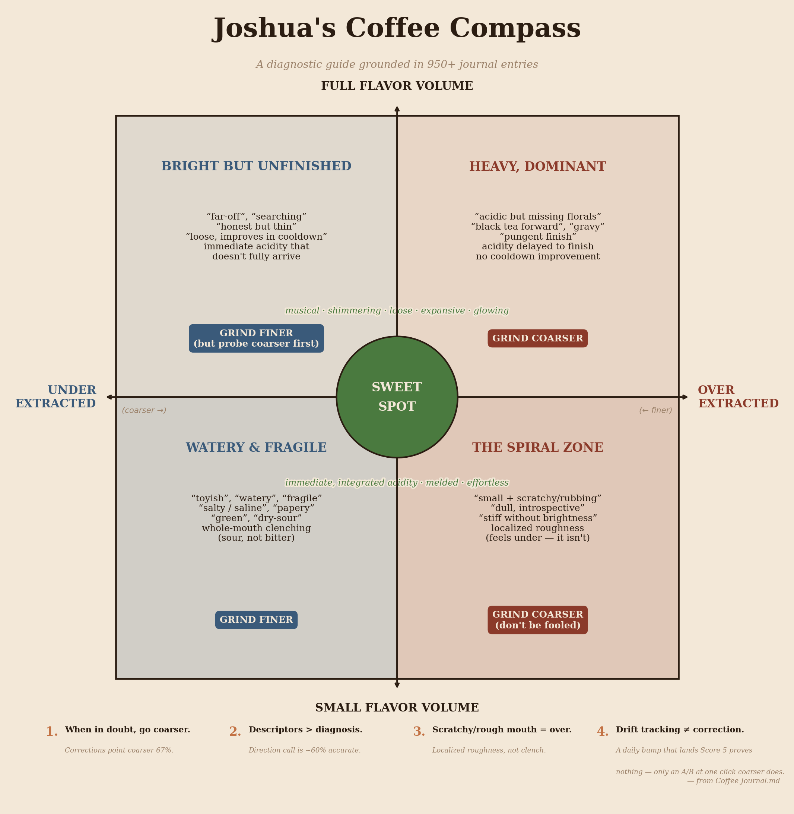
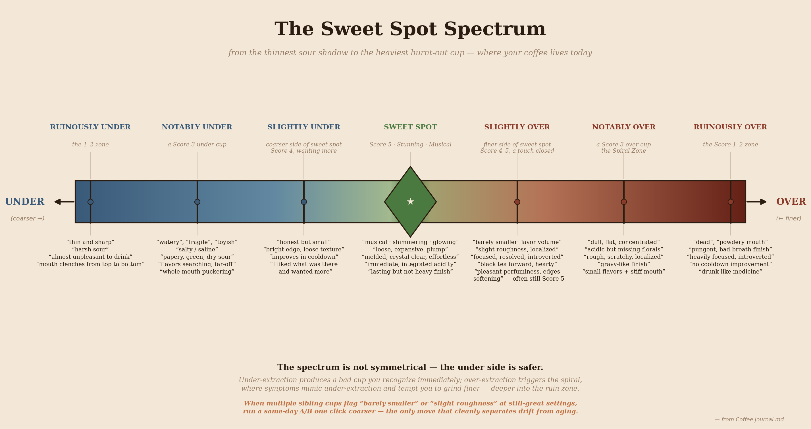

# Coffee Journal

A repo for dialing in specialty coffees through iterative prediction and measurement. It pairs a universal coffee-prediction methodology with one or more maintainers' calibrated journals.

The **goal**: predict the sweet-spot grind setting for a given coffee at a given age (days since roast). As coffee ages, CO₂ escapes and the cellular structure becomes more porous, shifting the sweet spot coarser at a roaster-specific rate. The methodology here tracks that drift and corrects for it — when it applies.

## Maintainers' journals

- [`joshua-martin/`](./joshua-martin/) — Joshua Martin (Lagom P64, Z1/Orea, specialty light roast). Drift-based prediction applies.

## For coding agents

Agent instructions live in **[`AGENTS.md`](./AGENTS.md)** (vendor-neutral). Start there. The underlying methodology is in [`AGENT_GUIDE.md`](./AGENT_GUIDE.md); task-triggered procedures are in [`skills/`](./skills/).

## Universal illustrations

These apply to any journal:

The Compass maps taste descriptors to extraction direction; the Spectrum maps the sweet-spot window, its edges, and what lies past the edges on either side.
