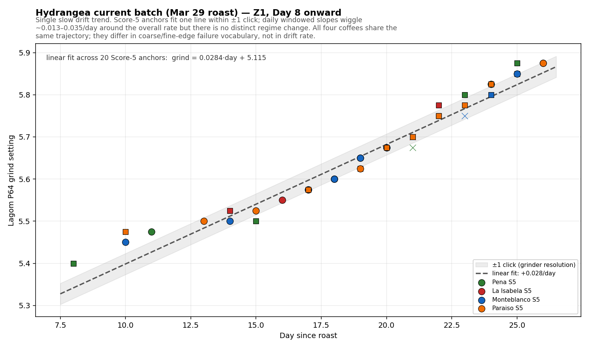
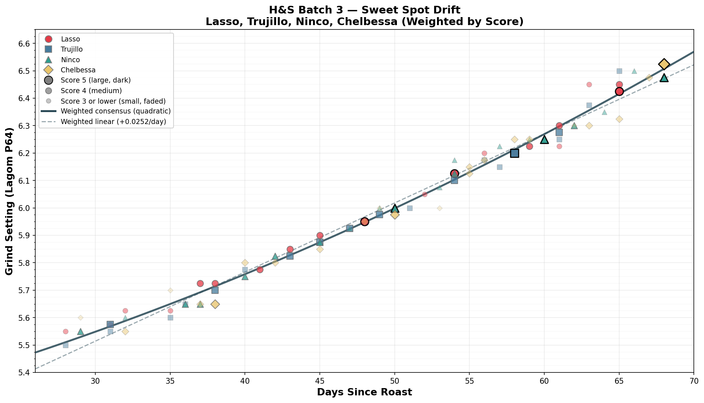
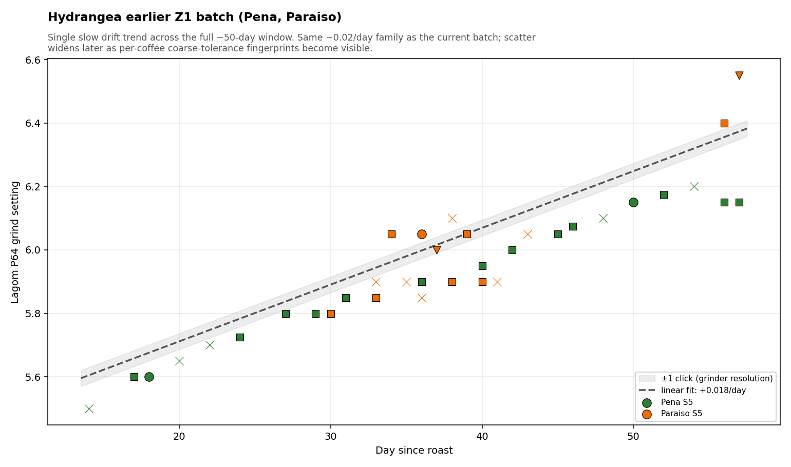
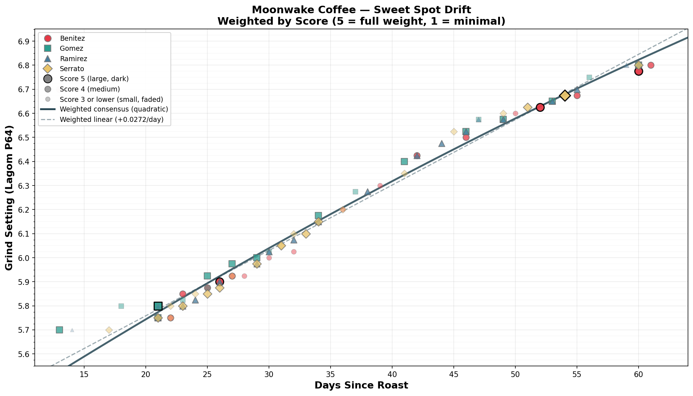
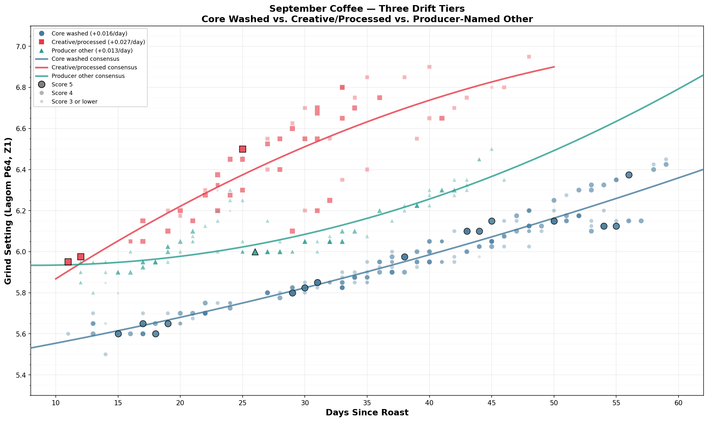
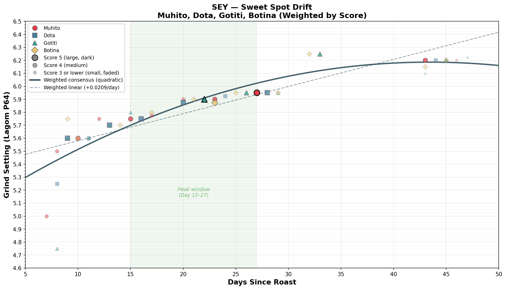
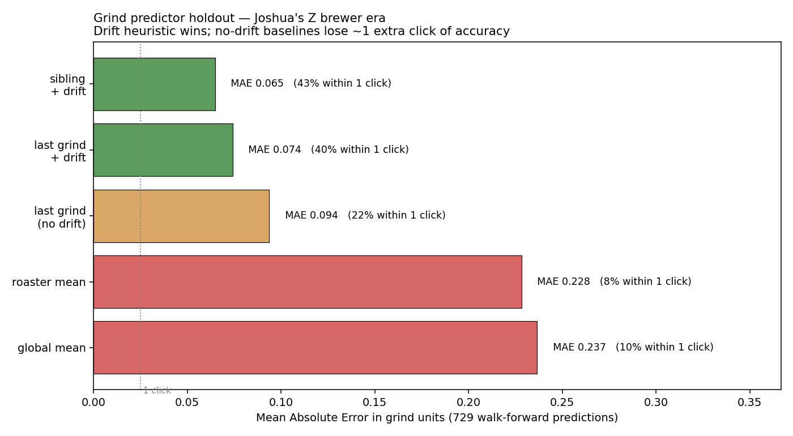
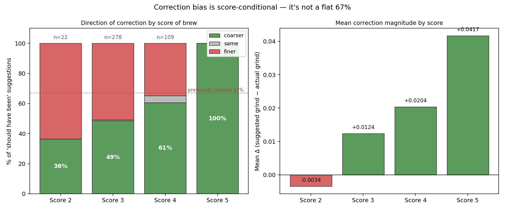
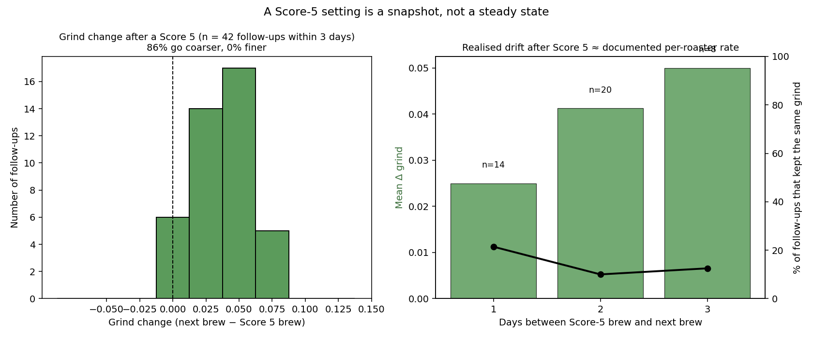

# Joshua Martin's Coffee Journal

A personal journal for dialing in specialty light-roast coffees on a Lagom P64 grinder and Z1 brewer.

Each entry tracks the grind setting, age, score, and tasting notes. Over time, patterns emerge — coffees from the same roaster age at the same rate, and the sweet spot drifts coarser by ~0.015–0.030/day depending on roast level and processing.

See [`profile.md`](./profile.md) for the calibration — roaster groupings, drift rates, correction bias, known failure modes, diagnosis accuracy per roaster. See [`Coffee Journal.md`](./Coffee%20Journal.md) for the raw entries.

For the universal methodology this profile builds on, see [`../AGENT_GUIDE.md`](../AGENT_GUIDE.md).

## Drift charts

## Holdout-validation charts

These come from the walk-forward holdout in [`profile.md` § 15](./profile.md#15-holdout-validation). Reproducible via the scripts in [`scripts/`](./scripts).

