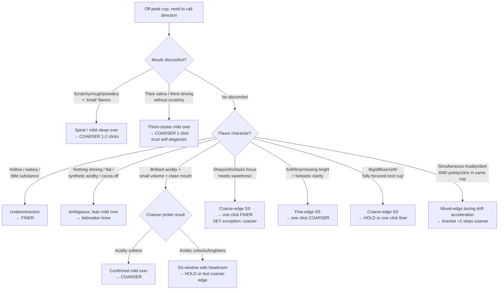

# Coffee Journal — Profile (Joshua)

Calibration file for Joshua's coffee journal. Pair with `AGENT_GUIDE.md` (universal methodology). The guide tells you how to predict; this file tells you the equipment, recipe, water, vocabulary quirks, and high-level patterns specific to this journal.

**Operating principle**: prefer simple models and fresh reads of the data. Per-batch fitted models (sigmoids, two-regime piecewise fits, per-coffee cluster splits) have historically been overfitted to noise and produced worse predictions than the universal methodology. When a per-batch hypothesis takes more than two sentences to state, distrust it.

## 1. Scope

- **Brew method**: pour-over, primarily Z1 (Zerno) with Orea in earlier entries and occasional Aeropress.
- **Roast profile**: specialty light-roast, often very light (H&S is among the lightest in the world).
- **Journal size**: ~1 year of daily entries, 4000+ lines of `Coffee Journal.md`.
- **Maintainer**: Joshua. Entries are top-to-bottom, earliest to most recent.

## 2. Equipment

- **Grinder**: **Lagom P64** (primary). Occasionally **Comandante C40** hand grinder (settings 24–27 range; incompatible scale with P64 — do not cross-compare numerically).
- **Grinder step size**: **0.025** on the dial = one click = 2.5 microns. **All predictions round to 0.025 increments** (e.g., 6.175, 6.200, 6.225).
- **Observed dial-value ranges**:
  - **Z1 / Zerno brewer**: ~5.0–7.0+ (most entries fall here).
  - **Orea brewer**: ~6.6–7.3 (earlier entries).
- **Brewer shorthand codes** (appear in entry headers):
  - `O` = Orea
  - `Z` = Z1 (Zerno)
  - Accessories: `M` = Melodrip, `NK` = Negotiated Kalita filters

## 3. Recipe Baseline

- **12.5g coffee / 250g water** at **211°F**, 5-pour method with Melodrip.
- When not otherwise noted in an entry, assume this recipe.

## 4. Water

- **Default**: custom mineralized water at **15 KH / 35 GH**. Very low-alkalinity, light on minerals — well below the SCA target of 68 GH / 40 KH — which maximizes brightness and acidity for light roasts at the cost of some body.
- **Variants observed** (flagged explicitly in entries when used):
  - **Crystal Geyser spring water** (~50–72 GH, ~50–55 KH) — shifts sweet spot **~0.05–0.10 coarser** vs. custom.
  - **Reverse osmosis** (e.g., Whole Foods store RO) — requires **finer** settings, but the intercept shift is **inconsistent across refills** (TDS 5–50 depending on membrane state). Treat RO entries as noisier than custom-water entries; don't let apparent intercept shifts on RO override the consensus curve.
- **Rule of thumb**: a water change shifts the sweet-spot baseline (intercept). It does **not** shift the drift rate (slope). Once dialed in to a new water, predictions proceed normally from the new anchor.

## 5. Rating Scale

1–5 scale, appended as `Score: X` in headers:

- **5** — transcendent. Header adjectives that reliably proxy Score 5: "stunning", "magical", "knockout", "musical", "wow wow wow", "absolutely perfect", "one of the best", "shimmering".
- **4** — solidly good. "Quite good", "really good", no major flaws.
- **3** — enjoyable but with obvious flaws.
- **2** — pretty unenjoyable.
- **1** — gross / disgusting. Extremely rare.

When scoring is ambiguous or missing from the header, **read the notes** — sentiment in prose is a more reliable signal than the terse header.

## 6. Entry Format

Each entry header follows:

```
## CoffeeName, Brewer, GrindSetting @ Temp, Dose/Water Day X Sentiment, Score: X
Tasting notes and next-setting suggestions.
```

- **Sweet-spot markers**: Joshua typically marks dialed-in cups with `**Sweet spot**` in notes or glowing language ("dialed in", "musical", etc.).
- **"Should have been X"**: Joshua's retrospective corrected estimate of the true sweet spot for that day. Highly valuable for calibration.
- **Day X**: days since roast date. Roast date is **Day 0**, not Day 1.
- **Same-day brews**: Joshua frequently brews the same coffee multiple times per day. Do not auto-increment Day X — always verify the current date and the latest journal entries before assuming a Day number.

## 7. Roasters (high-level only)

Per-batch drift rates and intercept fits have been removed because they encouraged extrapolation past data. Predict from the most recent same-coffee anchor + a roaster-typical drift estimate (§8) + sibling consensus when available. Each entry below lists only the coffees in current rotation and any stable, repeatedly-confirmed behavioral note.

### H&S Roasters
- Among the lightest roasts in the world. Densest "low-drift early, accelerating late" pattern.
- Past Day ~50, expect drift to accelerate; conservative one-click increments fall behind and produce S3 strings. When chasing acceleration, **bracket with +2–3 click jumps**.

### Hydrangea Coffee Roasters
- Recent batches: Pena (washed), La Isabela (natural), Paraiso (thermal shock), Monteblanco (co-ferment), and earlier Elida, Bolanos, Uberrimo.
- Notably **forgiving** through early-to-mid life — wide sweet-spot windows, high S5 density Day 8–20.
- Same-day sibling consensus is unusually strong in this roaster — when ≥2 of 4 siblings agree on a setting, trust that over own-coffee history.

### September Coffee
- Three loose tiers with different aging speeds:
  - **Core washed** (Pena, Morena, Bermudez, Velasco, Lasso-Sep, Castillo, Cuenca, Ortega, Pintado, Danche, Chelbesa): slow, very consistent across coffees.
  - **Creative / processed** (White Honey, Gingerbread, Putushio, Tamana / Tamama): faster early, decelerates by mid-life; tends to peak early.
  - **Producer-named other** (Buttercream, Sudan Rume, Fajardo, Martinez, Rojas): slowest, noisiest, hardest to diagnose. Highest overextraction-spiral rate. Lean heavily on sibling data.

### Moonwake Coffee Roasters
- Serrato, Gomez, Ramirez, Benitez.
- Sweet spots run notably **coarser** than other roasters at the same age (~6.6–6.7 at D50).
- Benitez is the most stable / distinct; vivid raspberry, rarely misdiagnosed.

### SEY
- Current batch: Guchienda (Kenya washed), Alba (pink bourbon), Bermudez (Colombian chiroso — pineapple / bright / hops), Meza (Gesha). Historical: Muhito, Dota, Gotiti, Botina (Bonita).
- **Narrowest sweet-spot window of any roaster in the journal** (~2 clicks each side instead of 3).
- **Misleading astringency is the defining diagnostic challenge** — see §11. The most reliable rule on SEY: **tight + scratchy + needs-sweetness without watery / hollow as the leading marker = OVER, fix coarser.** The only true-under signature on SEY has watery or hollow as the **leading** symptom.
- Self-diagnosis in-cup is unusually unreliable on SEY: the reflex to go finer when "needs sweetness" appears is almost always wrong on this roaster.
- Roaster publishes a 14-day rest floor; community evidence (multiple independent Reddit threads + SEY's own published guidance) lands closer to 3 weeks for peak. Pre-rest cups present as astringent / scratchy / tight regardless of grind.

### Paix
- Recent: Blue Strudel (natural Ethiopian), Blossom Wine (double-ferment washed Ethiopian), Amber Drop, Floral Standard (Andres Martinez washed Gesha).
- Roasted **darker** than the rest of the journal's calibration baseline — a Hydrangea-equivalent grind lands too coarse. Working baseline: one click finer than a Hydrangea-equivalent at equal age.
- **Under-rested signature D10–D17**: metallic-roasty (Ethiopians) or hollow-hazy (Gesha). The intervention is time, not grind, not temperature. Don't promote pre-D18 cups to S5 anchors.

### Other
- **Paix** — see above.
- **Norena** — roaster unknown.

**Important naming clash**: "Lasso", "Pena", and "Paraiso" each appear under multiple roasters at different points in the journal. Use journal position and context to determine which is which.

## 8. Drift-Rate Table

Treat these as **starting priors**, not fits. The realised slopes below come from the holdout study in §14 (Score ≥ 4 entries, OLS) and have proven stable across years of data. Per-batch refits historically overfit; trust the roaster-typical rate and let the most recent anchor set the intercept.

| Roaster                    | Drift / day  | Notes                                                                                            |
| -------------------------- | ------------ | ------------------------------------------------------------------------------------------------ |
| September (core washed)    | ~0.017       | Very consistent across coffees.                                                                  |
| September (creative)       | ~0.029       | Decelerates with age; peaks early.                                                               |
| September (producer-other) | ~0.012       | Slow, noisy, low diagnosis confidence.                                                           |
| H&S (any batch)            | ~0.018       | Accelerates past D50–58 to ~0.035+.                                                              |
| Hydrangea (earlier)        | ~0.018       | Sparse anchors.                                                                                  |
| Hydrangea (recent batches) | ~0.026–0.029 | Has shown late-life acceleration to ~0.035 past D27 in at least one batch.                       |
| Moonwake                   | ~0.024       | Coarser intercept than other roasters.                                                           |
| SEY                        | ~0.025       | Per-coffee slopes cluster 0.023–0.030. Within-batch fan-out ~one click at equal day.             |
| Paix                       | ~0.025–0.07  | Mid-life (D16–D27) runs hot at ~0.06–0.07; late-life (D27+) flattens to ~0.025 batch-wide. Highly batch-dependent. |

**Late-life acceleration is real for some roasters (H&S, sometimes Hydrangea) and not for others (Paix flattens, SEY drift-rate undocumented past D30 in current batch).** When chasing an accelerating bean, switch from 0.025 increments to 0.050–0.075 bracket jumps.

## 9. Correction Bias

Holdout count of "should have been X" annotations across the journal (n = 457):

| Score of brew | Coarser  | Finer | Same | Mean Δ     |
| ------------- | -------- | ----- | ---- | ---------- |
| 2             | 39 %     | 57 %  | 4 %  | +0.005     |
| 3             | 49 %     | 49 %  | 2 %  | +0.011     |
| 4             | **62 %** | 36 %  | 2 %  | +0.021     |
| 5             | 100 % (n=8) | 0 %   | 0 %  | +0.047     |
| **All**       | **53 %** | 46 %  | 2 %  | **+0.014** |

Overall corrections are essentially symmetric (53 / 46). The coarser bias is **score-conditional**: it emerges only once the cup is already close (S4+), where it represents drift-tracking rather than error-correction.

**Implications**:
- After an **S4+ cup**, prefer one click coarser on the next brew (drift-tracking).
- After an **S2–S3 cup**, the direction is genuinely uncertain — diagnose from vocabulary, don't default-bias.
- When the most recent S4 read **coarse-edge** ("could be pushed", "soft, slightly loose", "muted"), drift-forward alone is the prediction — do **not** add an additional coarser bias on top. Doing so double-counts the coarse-side movement.

## 10. Step-Size Distribution

Between consecutive entries of the same coffee on the Z brewer (n = 787):

| Step       | % of adjustments |
| ---------- | ---------------- |
| 0.050      | 30 %             |
| 0.000      | 17 %             |
| 0.025      | 16 %             |
| 0.100      | 11 %             |
| 0.075      | 10 %             |
| 0.125–0.15 | 6 %              |
| other      | 10 %             |

- A **one-click (0.025) miss is meaningful but not large** — it's inside the sweet-spot window most of the time.
- A 0.05 miss is the typical "noticeable" adjustment.
- 17 % of consecutive entries keep the same setting (drift-tracking at the window's center, or re-brew for confirmation).

**After a Score 5, the setting almost never holds.** Across 51 cases where Joshua brewed the same coffee within 3 days of a Score 5: 88 % went coarser, 0 % finer, mean +0.028/day. **Treat a Score 5 as a "today's setting" anchor, not a "this week's setting" anchor** — predict tomorrow at one click coarser by default.

## 11. Known Failure Modes

These are the diagnostic traps that have repeatedly caused misdiagnoses across batches. They are general patterns, not per-batch fits.

- **SEY misleading astringency.** SEY's natural "tight mouth + scratchy + needs-sweetness" vocabulary reads as under even when over. Finer adjustments make it worse. The reliable rule: **on SEY, scratchy/tight/needs-sweetness without watery or hollow as the leading marker = OVER, fix coarser.** The only true-under signature requires watery or hollow as the **primary** descriptor (e.g., "watery first sip + intensifying sharp acidity"). This trap fires on mild cases (S4) as well as deep cases (S3), so don't wait for a defect signature before applying it. Self-diagnosis in the cup is unreliable on SEY — the reflex to go finer when "needs sweetness" appears is almost always wrong.
  - **Thirst variant is the exception**: when a SEY cup reads "thirst-driving / thick saliva / could be coarser" without scratchy, the self-diagnosis is reliable and points genuinely coarser.

- **Overextraction spiral (universal, classic example: La Esperanza 2).** Score 4 at one setting; chase finer thinking it's under; cup degrades to S3 then S2 with growing mouth discomfort and shrinking flavors. Action: stop, bracket coarser by 2+ clicks.

- **Stalled-drift false alarm.** A multi-coffee same-day cluster of S4s with overlapping off-peak vocabulary looks like a real batch-level center shift but is often within bracket-corridor noise. Two prototypes from the Hydrangea batch:
  - Same-day cluster of "lean finer" calls can be **same-day noise** that the next-day brew (one day later, same setting) reveals as S5 — the center hadn't actually moved.
  - Same-day cluster of S3–S4 at the same setting can hide **opposite-sign diagnoses** (one coffee mild over, one genuinely under, one ambiguous).
  - **Lesson**: three siblings calling the same direction is necessary but not sufficient. Probe with a tiebreaker brew (±1 click) or a next-day same-setting brew before treating the consensus as real.

- **Confounded-cup contamination.** When the maintainer flags a cup as a possible dud, brewer-side defect, cold-start grind, weird off-flavor, or otherwise atypical, that cup's setting and direction read **must be discounted as an anchor** and **must not be allowed to seed batch-level theories** (decoupling, slope shifts, per-coffee offsets). The repeated failure mode is: 1–2 flagged-noisy cups in a row appear to show a coffee diverging from its siblings; the agent builds a working "this coffee runs coarser/finer than the trio" model; the next clean cup falsifies the divergence; the model has to be retracted. Rule of thumb: a working hypothesis about a coffee's behavior **needs at least one un-flagged S4+ confirmation** before it becomes operational. Flagged cups can corroborate a clean read; they cannot start one.

- **Mistaking late-life acceleration for "bean aged out".** When a previously-tracking coffee starts producing S4s with mixed-edge vocabulary at the conservative +1-step setting, the bean often has not aged out — it's just outside the +1 bracket during a drift acceleration. Bracket with +2 steps (0.050) before concluding the coffee is done.

- **Reference-anchor bias.** "Small flavor volume" in late-life cups compared against a Day 8–14 peak cup is often perceptual, not extraction-based. Fresh-coffee CO₂ lift and perfuminess fade regardless of grind. If other markers are sweet-spot-coded (loose, defined acidity, honest flavors, clean mouthfeel), the cup is likely peaking for its age. Stop chasing volume.

- **Under-rested batches (any roaster, especially Paix).** Cups in the first ~2 weeks off roast can read as under-developed (metallic, hollow, hazy) regardless of grind. The intervention is **time**, not grind, not temperature. Don't fit drift slope through pre-rest entries; don't promote pre-rest cups to S5 anchors.

- **RO water noise.** Several S3s on RO during long brewing runs have looked like an intercept shift but were brew variability. One S5 on the same RO at the same setting has disproved the shift hypothesis multiple times. Don't over-correct for RO water.

## 12. Diagnosis Accuracy (rough, by roaster)

Overall direction-call accuracy: **~60–65 %.** Roaster ordering (best → worst):

1. **Moonwake**, **September washed core**: ~70–75 % (vivid flavor profiles).
2. **H&S**, **Hydrangea**: ~65 %.
3. **September creative / processed**: ~60 %.
4. **September producer-named other**: ~50–55 %.
5. **SEY**: ~45–50 % (misleading astringency).

**#1 source of misdiagnosis: attributing scratchiness / roughness to underextraction when it's actually overextraction.**

## 13. Vocabulary Map

Descriptors with strong directional signal in Joshua's journal beyond the universal set. Organized by where they sit on the over / under spectrum.

### Sweet-spot spectrum (fine ← over | sweet spot | under → coarse)

| Position | Vocabulary cluster | Mouthfeel | Action |
|---|---|---|---|
| **Deep over** (2+ clicks too fine) | "gross / green / roasty / silty / metallic", "heavy / dark", "powdery", "harsh phenolic finish", flavors collapsed / dishonest | sandpapery, particulate, mouth-discomfort dominates cup | +2 clicks coarser; check if water / dose / temp are also off |
| **Mild over — scratchy variant** | "small flavor volume" + "scratchy / tight / rubbing / rough", "middle dip", "hopes it loosens", "nothing shining / cocoa off / synthetic acidity" | surface friction on tongue + lips, localized rasp | +1 click coarser; cup often self-misdiagnoses as "needs finer" — distrust direction call |
| **Mild over — thirst variant** | "thick saliva", "thirst-driving", "addictive juicy" (if balanced) or "muted / unfocused / want brighter" (if not), "sticky", "cloying" | thick / sticky salivary film, no powdery / scratchy roughness, makes you reach for water | +1 click coarser; cup self-diagnosis is **reliable** here, unlike the scratchy variant |
| **Finer edge of SS** | "barely smaller volume", "slight localized roughness", "focused / introverted", "black tea forward", "pleasant perfuminess, edges softening" | clean but with hints of either roughness or thickness | +1 click coarser next brew (drift-tracking) |
| **On center** | "loose", "open", "voluminous", "honest flavors", "musical / shimmering / melded", acidity immediate and integrated | clean, slippery saliva, no friction or coating | hold; expect drift to require +1 next day |
| **Coarser edge of SS** | "big in mouth, not quite focused initially", "soft / gentle / mouthfilling but diffuse", "may be fully focused by next cup", varietal acidity unlocks further when probed coarser | loose, expansive, clean | hold or +1 coarser (test edge) |
| **Mild under** | "loose + bright + softening + slightly diffuse", acidity present but thin / far-off, "searching for tasting notes" | loose, clean, possibly slightly watery | +1 click finer |
| **Deep under (hurricane)** | "large + foggy + structureless", "no sweetness", "hollow / watery / little substance", flavors present in surroundings but not in cup | thin, watery, no body | +2 clicks finer; rare past D14 in most batches |

### Key ambiguity resolutions

- **"Small flavor volume" alone is not directional.** It can be mild over (compression), under (incomplete extraction), or reference-anchor bias against an early-life peak cup. Always pair with mouthfeel and acidity-timing markers to call direction.
- **"Brilliant / effervescent acidity + small volume + clean mouthfeel"**: ambiguous. Probe coarser to disambiguate. If acidity _softens_ → confirmed mild over (finer next). If acidity _unlocks further_ → SS-window with varietal headroom (hold or coarser).
- **"Nothing shining / flat / synthetic acidity / cocoa off / balanced but flat"**: reads as under but frequently mild over. Brew a tiebreaker before committing direction.
- **"Sharp / citric / lacks focus / needs sweetness"** at SS-adjacent setting: usually **coarse-edge SS** (one click coarse of center). Acidity surfaces without structural support. Action: one click finer. **Exception: on SEY, this vocabulary almost always means over (fix coarser) — see §11.**
- **"Soft / limp / missing bright + fantastic clarity"**: fine-edge SS (one click fine of center). Brightness suppressed by slight-over without spiral signals. Action: one click coarser.
- **"Scratchy at cooldown" with _expanding_ flavor volume ≠ spiral.** Spiral requires shrinking flavors + mouth discomfort _together_. Expansion-during-cooldown is the disambiguator: scratchy + expanding = coarse-edge SS (finer); scratchy + shrinking = spiral (coarser).
- **Simultaneous mixed-edge vocabulary in one cup** (e.g., "muddy / dark" AND "pointy / citric"): often a fine-edge cup with residual coarse-edge tells during late-life drift acceleration, not a narrowed window. Bracket with +2 steps coarser before concluding the bean is aged out.

### Vocabulary → direction quick-reference



### Reference-anchor bias

"Small flavor volume" compared against a Day 8–14 peak cup is often **perceptual, not extraction-based**. Fresh-coffee CO₂ lift and perfuminess fade regardless of grind; late-life cups cannot reproduce the young-coffee "big first impression" at any setting. If other markers are sweet-spot-coded (loose, defined acidity, honest flavors, clean mouthfeel), the cup is likely peaking for its age. Stop chasing volume.

## 14. Holdout Validation

Walk-forward holdout on **754 same-coffee grind predictions** from the Z brewer era (P64 grinder only; Comandante entries excluded). Each predictor sees only prior history and predicts the next grind Joshua actually used.

| Predictor                    | MAE       | Bias   | RMSE  | ≤ 1 click | ≤ 2 clicks |
| ---------------------------- | --------- | ------ | ----- | --------- | ---------- |
| `snap_coarser`               | **0.064** | +0.002 | 0.165 | **35 %**  | **73 %**   |
| `last_plus_drift`            | 0.065     | +0.003 | 0.164 | 42 %      | 70 %       |
| `sibling_plus_drift`         | 0.066     | -0.001 | 0.147 | 43 %      | 66 %       |
| `last_score4plus_plus_drift` | 0.077     | +0.004 | 0.177 | 37 %      | 64 %       |
| `last_grind` (no drift)      | 0.091     | -0.026 | 0.191 | 22 %      | 57 %       |
| `best_prior_plus_drift`      | 0.099     | -0.001 | 0.194 | 30 %      | 52 %       |
| `bean_median5`               | 0.157     | -0.091 | 0.232 | 6 %       | 18 %       |
| `roaster_mean`               | 0.223     | -0.106 | 0.301 | 9 %       | 17 %       |
| `global_mean`                | 0.236     | -0.078 | 0.316 | 10 %      | 17 %       |

**Headline:** three predictors are statistically tied at MAE ≈ 0.064–0.066 (about 1.3 clicks of error, well inside the ~3-click sweet-spot window):

- **`snap_coarser`** (round last grind up to the next 0.025): a "round-coarser" baseline so dumb it's almost embarrassing, yet ties the drift model.
- **`last_plus_drift`** (last grind + per-roaster rate × days elapsed): the methodologically principled choice; lean on this for multi-day gaps.
- **`sibling_plus_drift`**: best RMSE; useful when same-coffee history is sparse or when batch consensus should challenge a noisy single prior.

Adding drift over a no-drift baseline cuts MAE from 0.091 → 0.065 (29 % improvement) and doubles the within-1-click hit rate. **Drift is real and worth modeling**, but the win over a one-click coarsening rule is small. In practice: trust the drift math when the day-gap is ≥2; trust the coarsening rule when the day-gap is 1 and there's no diagnostic reason to depart further.

Realised drift slopes (Score ≥ 4 entries, OLS) vs documented:

| Roaster                    | Documented  | Realised | n   | Verdict     |
| -------------------------- | ----------- | -------- | --- | ----------- |
| Hydrangea (current batch)  | 0.029       | +0.029   | 30  | ✓           |
| Hydrangea (earlier batch)  | 0.018       | sparse   | 5   | ⚠ low-n     |
| H&S (pooled, all batches)  | 0.015–0.018 | +0.022   | 106 | ✓           |
| H&S batch 3                | 0.018       | +0.018   | 37  | ✓           |
| Moonwake                   | 0.024       | +0.024   | 44  | ✓           |
| SEY (Z, no Comandante)     | 0.025       | 0.023–0.030 | 62  | ✓           |
| September (washed)         | 0.017       | +0.017   | 58  | ✓           |
| September (creative)       | 0.029       | +0.029   | 31  | ✓           |
| September (producer-other) | 0.012       | +0.012   | 26  | ✓           |

### Heuristic stress-tests

- **Score-3 recovery (n = 277 follow-up brews).** Going coarser after a S3 recovered to ≥4 in **39 %** of cases (n=218); going finer recovered in **42 %** (n=59). Joshua defaults to coarser 79 % of the time, but the data does **not** show coarser as the higher-recovery move from a fresh S3 — it just reflects that drift-tracking dominates. **Treat "round coarser" as drift-tracking advice, not as a recovery move.** When the prior cup was clearly bad, weigh the descriptors and don't default-bias the direction.
- **Score 5 → next brew (n = 51 within 3 days).** 88 % went coarser, 0 % finer, mean +0.028/day. **A Score 5 setting almost never holds.**
- **Score 5 lineage (n = 74).** 70 % of S5 brews followed an S4 or S5. Convergence-by-refinement is the dominant path; "lucky correction" is rare.
- **Distance-to-good-grind vs score (n = 716).** Sweet-spot window is **roughly 3 clicks wide** (-0.075 to +0.075 from the coffee's median good grind).
- **Sibling convergence (n = 640 Score-5 vs same-roaster Score-≥4 sibling within 2 days).** Median grind spread 0.050 (2 clicks); only 22 % of pairs agree within 1 click. Siblings are useful priors but **noisier than intuition suggests**. Use sibling consensus as a tiebreaker when within 2–3 clicks of own-history prediction; distrust it when it disagrees by more.

## 15. Lessons for the Agent

These are meta-lessons accumulated from past mis-predictions. Re-read before predicting.

- **A fresh read of the data beats a fitted per-batch model almost every time.** Sigmoids, two-cluster splits, three-regime piecewise fits, and per-coffee-t₀ hypotheses have all been built on partial data, then falsified by the next 2–3 anchors. When tempted to build a model, ask: would the universal methodology (most recent S4+ anchor + roaster-typical drift + sibling consensus) have called the next brew within one click? Usually yes.
- **The freshest in-cup self-call (e.g., `**6.025?**`) plus drift is the strongest single anchor available.** It implicitly captures whatever drift actually happened between the last clean S5 and today; you only need to add forward drift from today to the prediction date. Older S5 anchors require you to extrapolate a slope that may have changed; self-calls don't. When self-call and older-anchor predictions disagree, default to self-call + drift.
- **Drift is monotonic and slow.** "Plateau" never means "stopped" — it means "slowed." Re-running a 4-day-old setting expecting the same result is a category error.
- **Polarity check before every direction call.** In this journal: **over = overextracted = too fine** (fix coarser). **Under = underextracted = too coarse** (fix finer). Re-state these to yourself before interpreting any vocabulary.
- **Run `date` every session.** Multi-turn sessions cross midnight. Stale day numbers shift every intercept by one slope-unit.
- **Day N = today − roast date in calendar days.** Don't copy from sibling labels — calendar wins.
- **Always re-read the journal tail (~20 lines) immediately before appending a new header.** A "trapped" still-blank header from a prior turn breaks the notes-to-coffee mapping.
- **When prediction logic produces a coarser-than-yesterday call from the same vocabulary that just made the user go finer (or vice versa), stop and re-check the polarity of every adjective in your reasoning chain.**
