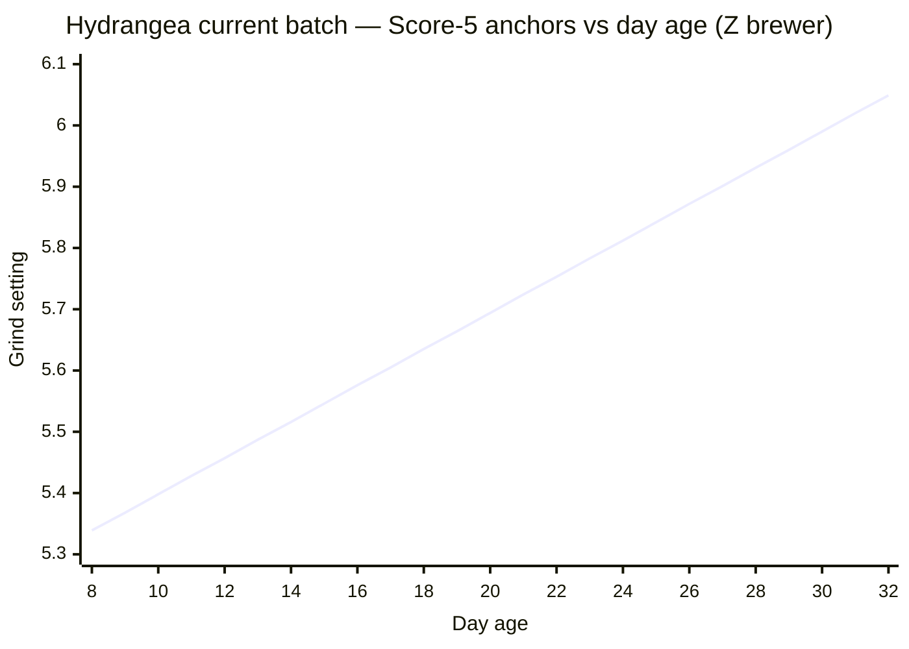
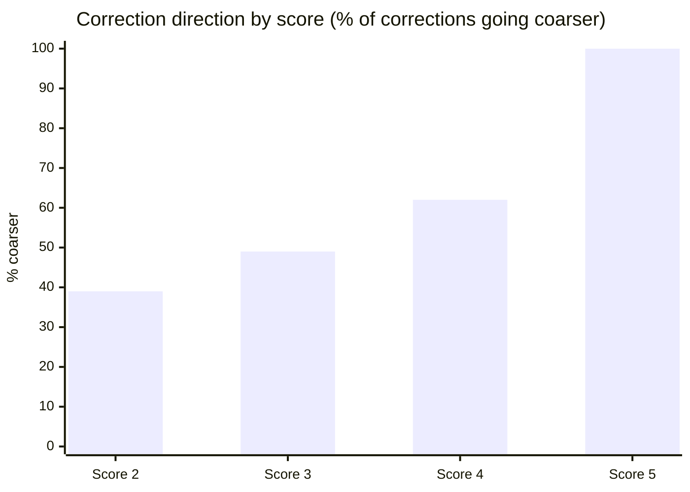
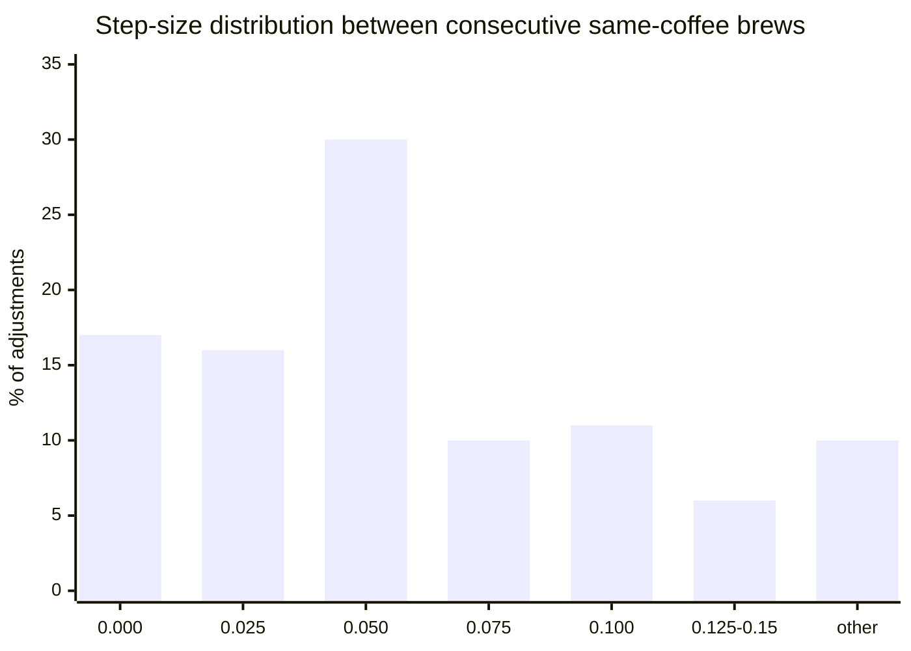
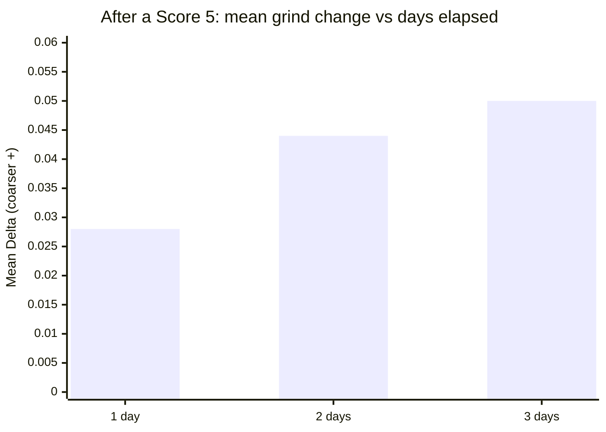
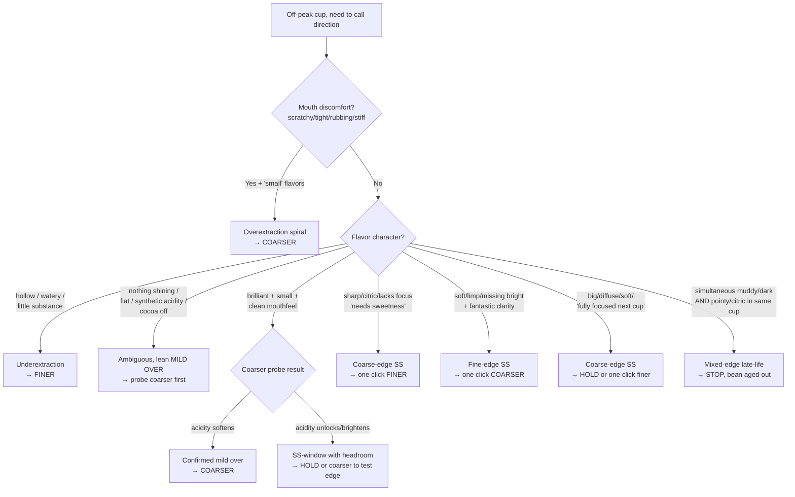
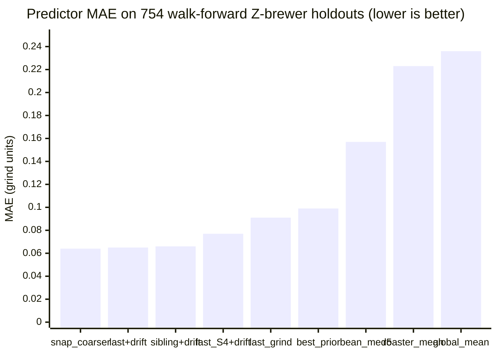

# Coffee Journal — Profile (Joshua)

Calibration file for Joshua's coffee journal. Pair with `AGENT_GUIDE.md` (universal methodology). The guide tells you how to predict; this file tells you the numbers and patterns specific to this journal.

## 1. Scope

- **Brew method**: Pour-over, primarily Z1 (Zerno) with Orea in earlier entries and occasional Aeropress.
- **Roast profile**: Specialty light-roast, often very light (H&S is among the lightest in the world).
- **Journal size**: ~1 year of daily entries, 3800+ lines of `Coffee Journal.md`.
- **Maintainer**: Joshua. Entries are top-to-bottom, earliest to most recent.

## 2. Equipment

- **Grinder**: **Lagom P64** (primary). Occasionally **Comandante C40** hand grinder (settings 24–27 range; incompatible scale with P64 — do not cross-compare numerically).
  - "Lagom" is the grinder brand, not a roaster.
- **Grinder step size (dial increment)**: **0.025** on the dial = 2.5 microns. **All predictions round to 0.025 increments** (e.g., 6.175, 6.200, 6.225).
- **Observed dial-value ranges**:
  - **Z1/Zerno brewer**: ~5.0–7.0+ (most entries fall here).
  - **Orea brewer**: ~6.6–7.3 (earlier entries).
- **Brewer shorthand codes** (appear in entry headers):
  - `O` = Orea
  - `Z` = Z1 (Zerno)
  - Accessories: `M` = Melodrip, `NK` = Negotiated Kalita filters

## 3. Recipe Baseline

- **12.5g coffee / 250g water** at **211°F**, 5-pour method with Melodrip.
- When not otherwise noted in an entry, assume this recipe.

## 4. Water

- **Default**: Custom mineralized water at **15KH / 35GH**. Very low-alkalinity, light on minerals — well below the SCA target of 68GH/40KH — which maximizes brightness and acidity for light roasts at the cost of some body.
- **Variants observed** (flagged explicitly in entries when used):
  - **Crystal Geyser spring water** (~50–72 GH, ~50–55 KH) — shifts sweet spot **~0.05–0.10 coarser** vs. custom. Confirmed: September batch shifted coarser on Crystal Geyser and back down when returning to custom.
  - **Reverse osmosis (RO)** — e.g., Whole Foods store RO. Requires **finer** settings, but the intercept shift is **inconsistent across refills** (TDS 5–50 depending on membrane state). Treat RO entries as **noisier** than custom-water entries — don't let apparent intercept shifts on RO override the consensus curve. One H&S batch 3 instance (Day 56–60) showed several Score 3s on RO that looked like an intercept shift, but a Score 5 at the same setting on the same water disproved it.
- **Rule of thumb**: A water change shifts the sweet spot baseline (intercept). It does **not** shift the drift rate (slope). Once dialed in to a new water, predictions proceed normally from the new anchor.

## 5. Rating Scale

1–5 scale, appended as `Score: X` in headers:

- **5** — Transcendent. Header adjectives that reliably proxy Score 5: "Stunning", "Magical", "Knockout", "Musical", "wow wow wow", "absolutely perfect", "one of the best", "shimmering".
- **4** — Solidly good. "Quite good", "really good", no major flaws.
- **3** — Enjoyable but with obvious flaws.
- **2** — Pretty unenjoyable.
- **1** — Gross/disgusting. Extremely rare.

When scoring is ambiguous or missing from the header, **read the notes** — sentiment in prose is a more reliable signal than the terse header.

## 6. Entry Format

Each entry header follows:

```
## CoffeeName, Brewer, GrindSetting @ Temp, Dose/Water Day X Sentiment, Score: X
Tasting notes and next-setting suggestions.
```

- **Sweet-spot markers**: Joshua typically marks dialed-in cups with `**Sweet spot**` in notes or glowing language ("dialed in", "musical", etc.).
- **"Should have been X"**: Joshua's retrospective corrected estimate of the true sweet spot for that day. Highly valuable for calibration.
- **Day X**: Days since roast date.
- **Same-day brews**: Joshua frequently brews the same coffee multiple times per day. Do not auto-increment Day X — always verify the current date and the latest journal entries before assuming a Day number.

## 7. Roaster Groupings

Coffees are named after producers / farms / creative names. Multiple coffees from the same roaster age similarly and often share the same sweet spot at the same age.

### H&S Roasters

- **Orea era**: Pineda, Vista, Pena, Lasso Mejorado\*, Lopez, San Antonio (decaf)
- **Z1 batch 1**: La Esperanza 2, La Esperanza, Gatomboya, Karani, Iridescence, Kiamwangi, Banko Taratu, Placer
  - Drift **~0.015/day during Day 28–50**, then **accelerates to ~0.035–0.050/day past Day 50** (Placer went from 6.25 at Day 53 to 6.75 at Day 63)
- **Z1 batch 2**: Birthday Cake, Rumudamo (natural + washed)
- **Z1 batch 3 (most recent)**: Trujillo, Lasso, Ninco, Chelbessa
- **Likely H&S**: Karianini, later Paraiso
- Drift rates vary by batch: batch 1 ~0.015/day, batch 3 ~0.023/day
- **H&S batch 3 showed acceleration past Day 58** (~0.033–0.042/day), matching batch 1's late-age pattern. Earlier entries at 6.2–6.25 on Day 59–61 that appeared underextracted were actually overextracted — the overextraction spiral mimicked underextraction with "small, watery" flavors. Going coarser (6.275, then 6.3) improved scores, confirming the acceleration. By Day 63, the sweet spot may be at 6.4+. At this acceleration rate, **use bigger jumps (0.05–0.075) rather than single 0.025 increments** to keep up. The late-age spiral (Day 58–68) cost 24 entries before a Score 5 was achieved again via the bracketing strategy — a cautionary example of how chasing with conservative increments during acceleration wastes brews.

_\*Lasso Mejorado is roasted by Paix, a separate roaster._

### Hydrangea Coffee Roasters

- Uberrimo, Bolanos, Paraiso, Elida, Pena (most recent), La Isabela (natural), Monteblanco (co-ferment)
- Thermal shock processing is a Hydrangea method.
- Z1 sweet spot **~6.0–6.1 around Day 34–40** for the earlier batch (Elida, Bolanos, Uberrimo); fit is sparse (n=5 Score-4+ anchors) but consistent.
- Elida was the standout (multiple Score 5 entries); Uberrimo and Bolanos were subtler and harder to dial in.
- Hydrangea coffees were notably forgiving early (Uberrimo scored 5 on Day 8 on the Orea).
- **Most recent batch** (Pena washed, La Isabela natural, Paraiso thermal shock, Monteblanco co-ferment, all roasted ~March 29): **one single slow drift trend of ~0.030/day across Day 9–31**, fit linearly across all 32 Score-5 anchors (grind = 0.0296·day + 5.102, residuals within ±0.08 of the fit, all but one inside ±0.06, every point within the ±2-click corridor). See drift chart below.



_Line shows OLS fit (grind = 0.0296·day + 5.102) across Day 8–32. Score-5 anchors (n=32): D9 5.45, D10 5.45, D11 5.475, D13 5.50, D14 5.50, D15 5.525, D16 5.55, D17 5.575×2, D18 5.60×4, D19 5.625, D19 5.65×2, D20 5.675×2, D24 5.825, D25 5.85, D26 5.875×3, D27 5.90×3, D28 5.95, D29 5.975, D30 6.00, D30 6.025, D31 6.05×2._

- The roaster's approach dominates over processing method for baseline setting — all four coffees share the same trajectory. **They differ in _how they fail_ past the sweet spot (per-coffee coarse- and fine-edge vocabulary, see §13), not in drift rate.** Earlier §8 language about "three regimes", "acceleration past Day 20", or "CO₂ phase ending Day 14–15" overstated what are really day-to-day wiggles around one slow trend. Drift is slow and generally predictable; batch behaviour should be assumed similar across batches unless a clean multi-week falsification appears.
- **Windowed (3-day) slopes do wiggle** between ~0.013/day and ~0.035/day, but these swings are within noise of the overall +0.030/day fit and coincide with sampling density, not genuine regime change. Treat them as noise, not signal.
- **Sweet-spot anchors along the trend**:
  - Day 9–11: **~5.45–5.48** (Score 5: La Isabela D9, Monteblanco D10, Pena D11)
  - Day 13–15: **~5.50–5.53** (Score 5: Paraiso D13, Monteblanco D14, Paraiso D15)
  - Day 16–18: **~5.55–5.60** (Score 5 across all four)
  - Day 19–20: **~5.625–5.675** (Score 5 across all four)
  - Day 22–23: **~5.75–5.80** (sparser, see per-coffee triangulation below)
  - Day 24–26: **~5.825–5.875** (Score 5: Pena D24+D26, Monteblanco D25, Paraiso+Pena D26)
  - **Day 27 (4-way 5.90 cluster)**: Monteblanco, Pena, Paraiso, La Isabela all Score 5 at the same setting on the same day — strongest single-day batch convergence event in the entire journal.
  - **Day 28**: La Isabela 5.925 → S4 ("losing brightness, barely rough"), Monteblanco 5.95 → S5. The bracket places true Day-28 SS center at ~5.94, slightly ahead of the +0.030/day trend prediction (5.93). One click of acceleration over a single day is within noise; not yet a regime claim.
  - **Day 29–30**: La Isabela D29 5.975 → S5 ("tight, bright, zingy purple grape, a bit toyish"); Monteblanco D30 6.00 → S5; Paraiso D30 backstep test at 5.80 → S4 ("a little weaker"), then walked back to 6.025 → S5 ("excellent first sip, open, gentle, expressive, soft peach gummy"). The 6.025 anchor falls +0.039 above the trend prediction (5.99) — the largest residual past Day 25 and the only one >+0.025. Pena D30 6.00 → S4 begins a divergent walkback that breaks Pena from the four-coffee consensus.
  - **Day 31 (sibling SS at 6.05)**: La Isabela 6.05 → S5 ("crisp, fruits and sweetness nicely poised and clean through cooldown"); Monteblanco 6.05 → S5 ("clean soapy-like passionfruit, purplish, sweet-tart"). Both land +0.030 above the (refit) trend prediction of 6.020 — the +0.030–0.040 residual cluster past Day 27 is now consistent enough to flag as systematic late-life acceleration rather than noise. Pena was not brewed Day 31 (skipped after Day 30 S4).
  - **Day 32**: Pena 6.075 → S4 ("muddy and dark overall though still a bit pointy/citric") — mixed-edge vocabulary (fine-edge "muddy/dark" + coarse-edge "pointy/citric") on the same cup. Pena's late-life divergence is now read as **bean aging out** rather than a recoverable grind miss; the SS window has narrowed to where neither edge resolves cleanly. Don't chase further on Pena. **Paraiso 6.10 → S4** with coarse-edge vocabulary ("each sip soft glow that falls off, expansiveness grows through cooldown, peach-gummy out of focus, scratchy mouth at cooldown alongside _expanding_ flavor") brackets Paraiso's Day-32 SS-center at ~6.075 — same as the +1-step extrapolation from Day-31's sibling consensus (6.05). Falsifies the "Paraiso runs coarser of batch" hypothesis that the Day-30 one-click spread (6.025 vs. 6.00) suggested.
- **70% Score-5 rate on Days 8–20 with zero Score 3s** — best-performing stretch in the journal by a wide margin, consistent with a well-characterised single trend in a cold-start-friendly roaster profile.
- **Day 21–23 score drop is drift-outrunning-grinder-resolution, not batch disintegration**: 0.025 grinder step vs. a ~0.029/day true rate means roughly one in three days will land a click off-center. Flavors stay clean and varietal through the drop; see "Score-rate collapse as a drift-regime signal" in the guide.
- **Per-coffee coarse-tolerance emerges at the edges of the SS window, not as divergent drift**:
  - **Day 21** three-way drop at 5.7: Pena mild over, La Isabela genuinely under, Paraiso ambiguous. Same setting, opposite signs. Resolved by tiebreaker (Pena finer at 5.675 → Score 3 with overextraction spiral signals, confirming mild over at 5.7).
  - **Day 22** four-way Score-4 at 5.75: all four share a ~5.74–5.75 SS center; they differ in how they fail past it. La Isabela + Paraiso stay bright/loose (coarse-tolerance with varietal-acidity headroom); Monteblanco reads soft/limp (fine-edge SS, one click fine of center); Pena reads sharp/citric (coarse-edge SS). See §13 for full fingerprints.
  - **Day 23** triangulation landed a shared center of ~5.785–5.79 — consistent with the +0.028/day trend from Day 22's ~5.75.
  - **Late-life Pena divergence (Day 27→32)**: Pena's S4-ceiling persists across 5.85–6.075 with vocabulary trending "cocoa-forward, dark, less vibrant" while the other three keep landing S5s on the trend. Day 32 @ 6.075 → S4 with mixed-edge vocabulary ("muddy/dark" + "pointy/citric" in the same cup) confirms the bean has aged out — the SS window has narrowed to where neither coarser nor finer resolves cleanly. **Treat Pena as out-of-window past Day 30 for this batch.**
- **Calibration lesson** (Day 21): Same-day parallel drops with overlapping off-peak vocabulary can hide opposite-sign diagnoses. See §11 "Stalled-drift false alarm."
- **Reference-anchor bias**: "small flavor volume" in late-life cups (Day 22+) compared against Day 9's peak perfuminess is often perceptual, not extraction-based. Fresh-coffee CO₂ lift and perfuminess fade regardless of grind. If other markers are sweet-spot-coded (loose, defined acidity, honest flavors, clean mouthfeel), the cup is likely peaking for its age.

### September Coffee

- **Core washed batch**: Pena (Z1), Morena, Bermudez, Velasco, Lasso (Sep), Castillo, Cuenca, Ortega, Pintado, Danche, Chelbesa
- **Creative/processed**: White Honey, Gingerbread, Putushio, Tamana/Tamama
- **Producer-named other**: Buttercream, Sudan Rume, Fajardo, Martinez, Rojas
- Three distinct drift tiers:
  - **Core washed**: **~0.015/day** — very tight clustering, 11 coffees within ~0.1 of each other.
  - **Creative/processed**: **~0.027/day linear**, but **decelerates** from ~0.036 to ~0.020/day — converges with washed rate by Day 40. Likely honey/natural/anaerobic processing → more soluble compounds → faster early aging. Peaked early (Score 5s only through Day 25).
  - **Producer-named other**: **~0.013/day** — slowest, noisiest, hardest to diagnose. Most overextraction-spiral incidents came from this group. Only 1 Score 5 across ~90 entries (Buttercream Day 26). Diagnosis accuracy ~50–55% — lean heavily on sibling data for these coffees.

### Moonwake Coffee Roasters

- Serrato, Gomez, Ramirez, Benitez
- Drift: **~0.025–0.029/day**
- Sweet spots are notably **higher** than other roasters at the same age (~6.6–6.7 at Day 50).
- Tightest convergence of any roaster batch — all four within 0.05 of each other at key ages.
- Benitez is the most stable/distinct (vivid raspberry, almost never misdiagnosed); Serrato the most polarizing ("not my favorite profile" but well-executed).

### SEY

- Muhito, Dota, Gotiti, Botina (Bonita)
- "SEY grassy/spicy quality", "SEY citric spiciness"
- Drift: **~0.020/day**
- These coffees were erratic and hard to dial in on the Z1.
- **Narrow sweet spot window** (~0.35 range vs. ~0.5+ for Hydrangea) and **misleading astringency** — they read as underextracted (tight mouth, green qualities) even when overextracted, leading to repeated finer adjustments that made things worse.
- **Highest overextraction spiral vulnerability of any roaster** (~15% of entries hit the "small + mouthfeel" dual pattern).

### Other

- **Paix**: Lasso Mejorado only.
- **Norena**: Roaster unknown.

**Important naming clash**: "Lasso", "Pena", and "Paraiso" each appear under multiple roasters at different points in the journal. Use journal position and context to determine which is which. A "Lasso" entry early in the journal (Orea, Paix) is a completely different coffee than one later (September Coffee Z1) or the most recent (H&S Z1).

## 8. Drift-Rate Table (Summary)

| Roaster / Batch                | Drift/Day  | Notes                                                                                                                                                                                                                                                                                                                                                                                                                                                                                                                                                                                                                                                                        |
| ------------------------------ | ---------- | ---------------------------------------------------------------------------------------------------------------------------------------------------------------------------------------------------------------------------------------------------------------------------------------------------------------------------------------------------------------------------------------------------------------------------------------------------------------------------------------------------------------------------------------------------------------------------------------------------------------------------------------------------------------------------- |
| September (core washed)        | ~0.017     | Very consistent across coffees                                                                                                                                                                                                                                                                                                                                                                                                                                                                                                                                                                                                                                               |
| September (creative/processed) | ~0.029 avg | Gingerbread, White Honey; decelerates from ~0.036 to ~0.020                                                                                                                                                                                                                                                                                                                                                                                                                                                                                                                                                                                                                  |
| September (producer other)     | ~0.012     | Fajardo, Martinez, Rojas, Sudan Rume, Buttercream; slow, noisy                                                                                                                                                                                                                                                                                                                                                                                                                                                                                                                                                                                                               |
| H&S batch 1                    | ~0.015     | Karani, Gatomboya, Iridescence; **accelerates to 0.035–0.050 past Day 50**                                                                                                                                                                                                                                                                                                                                                                                                                                                                                                                                                                                                   |
| H&S batch 3                    | ~0.018     | Trujillo, Lasso, Ninco, Chelbessa; **accelerates to ~0.033+ past Day 58**                                                                                                                                                                                                                                                                                                                                                                                                                                                                                                                                                                                                    |
| Hydrangea (earlier batch)      | ~0.018     | Elida, Bolanos, Uberrimo. Sparse Score-4+ anchors (n=5); informed prior, low confidence.                                                                                                                                                                                                                                                                                                                                                                                                                                                                                                                                                                                     |
| Hydrangea (most recent batch)  | ~0.030     | Pena, La Isabela, Monteblanco, Paraiso. **Single slow trend across Day 9–31.** Linear fit across 32 Score-5 anchors: grind = 0.0296·day + 5.102, residuals within ±0.08 (all but one inside ±0.06), every point inside a ±2-click corridor. Day-to-day windowed slopes wiggle (~0.013–0.035/day) but do not constitute distinct regimes. All four coffees share the trajectory; they differ in _how they fail_ past the SS window (per-coffee coarse- and fine-edge fingerprints, see §13), not in drift rate. Score-rate dropped from ~70% S5 to a string of S4s around Day 21–23 without vocabulary shift — the signature of drift outrunning the 0.025 grinder step, not a new regime. **Late-life note (Day 27+)**: three of four coffees still landing S5s on-trend (Day 31 sibling SS at 6.05, +0.030 above refit); Pena alone showing S4-ceiling and mixed-edge vocabulary at Day 32 — read as bean aging out. See §7, §13. |
| Moonwake                       | ~0.024     | Serrato, Gomez, Ramirez, Benitez                                                                                                                                                                                                                                                                                                                                                                                                                                                                                                                                                                                                                                             |
| Sey                            | ~0.020     | Muhito, Dota, Gotiti, Botina/Bonita; narrow window, spiral-prone. n=12 Score-4+ Z-brewer anchors after excluding Comandante entries (incompatible scale). Treat as low-medium confidence; revisit when more Sey data lands.                                                                                                                                                                                                                                                                                                                                                                                                                                                  |

### Per-roaster Score-5 anchors (Z brewer)

Score-5 anchors used for the OLS fits above. Mermaid `xychart-beta` doesn't support scatter, so the raw points are listed instead — the fit slope is what matters for prediction; the cluster shape is what matters for sanity-checking the fit.

**H&S batch 3** (Trujillo, Lasso, Ninco, Chelbessa) — fit: `grind = 0.018·day + 5.30`

| Day | 19   | 48   | 50   | 54    | 55    |
| --- | ---- | ---- | ---- | ----- | ----- |
| S5  | 5.65 | 5.95 | 6.00 | 6.125 | 6.125 |

Late-age Score-3 string (Day 58–68) sits above the trend, signaling acceleration past Day 58 — see §7 H&S narrative.

**Hydrangea earlier batch** (Elida, Bolanos, Uberrimo) — sparse anchors (n=2 S5 + 3 S4), fit assumed at +0.018/day informed by the current batch's structure.

| Day | 34  | 37  |
| --- | --- | --- |
| S5  | 6.0 | 6.1 |

**Moonwake** (Serrato, Gomez, Ramirez, Benitez) — fit: `grind = 0.024·day + 5.33`

| Day | 21  | 52    | 54    | 60    |
| --- | --- | ----- | ----- | ----- |
| S5  | 5.8 | 6.625 | 6.675 | 6.775 |

Tightest convergence of any roaster batch (Score-4 cluster within 0.05 of each other at every age).

**September washed core** — fit: `grind = 0.017·day + 5.42`

| Day | 15  | 17   | 29  | 30    | 31   | 38    | 43  | 44  | 45   | 54    | 56    |
| --- | --- | ---- | --- | ----- | ---- | ----- | --- | --- | ---- | ----- | ----- |
| S5  | 5.6 | 5.65 | 5.8 | 5.825 | 5.85 | 5.975 | 6.1 | 6.1 | 6.15 | 6.125 | 6.375 |

Densest Score-5 carpet of any roaster — eleven coffees with similar drift make this the most predictable group.

**Sey** (Z brewer, Comandante excluded) — fit: `grind = 0.020·day + 5.44`

| Day | 22  | 27   |
| --- | --- | ---- |
| S5  | 5.9 | 5.95 |

Only two Score-5 anchors; rate is informed mostly by Score-4 cluster spanning Day 9–28 (5.6 → 5.95). Narrow SS window means most cups stop at S4 even when well-calibrated.

## 9. Correction Bias

Holdout count of "should have been X" annotations across the journal (n = 457):

| Score of brew | Coarser         | Finer | Same | Mean Δ     |
| ------------- | --------------- | ----- | ---- | ---------- |
| 2             | 39 %            | 57 %  | 4 %  | +0.005     |
| 3             | 49 %            | 49 %  | 2 %  | +0.011     |
| 4             | **62 %**        | 36 %  | 2 %  | +0.021     |
| 5             | **100 %** (n=8) | 0 %   | 0 %  | +0.047     |
| **All**       | **53 %**        | 46 %  | 2 %  | **+0.014** |



The previously-cited "67 % coarser" figure was wrong — overall the corrections are essentially symmetric (53 / 46). The coarser bias is **score-conditional**: it only emerges once the cup is already close (Score 4+), where it represents drift-tracking, not error-correction.

**Implication:** "When ambiguous, round coarser" applies after a Score-4-or-better brew. After a Score-2-or-3 brew, the direction is genuinely uncertain — diagnosis matters more than a default bias.

## 10. Step-Size Distribution

Between consecutive entries of the same coffee on the Z brewer (n = 787), Joshua's grind adjustments:

| Step       | % of adjustments |
| ---------- | ---------------- |
| 0.050      | 30 %             |
| 0.000      | 17 %             |
| 0.025      | 16 %             |
| 0.100      | 11 %             |
| 0.075      | 10 %             |
| 0.125–0.15 | 6 %              |
| other      | 10 %             |



A **one-click (0.025) miss is meaningful but not large** — it's inside the sweet-spot window most of the time. A 0.05 miss is the typical "noticeable" adjustment. 17 % of consecutive entries keep the setting the same (drift-tracking at the window's center, or a re-brew for confirmation). The 10 % at 0.075 is a meaningful bucket: when bracketing or chasing a fast drift, Joshua reaches for three-click jumps before going to a half-dial 0.10 move.

**After a Score 5, the setting almost never holds.** Across 51 cases where Joshua brewed the same coffee within 3 days of a Score 5:

| Gap    | n   | Kept setting | Mean Δ |
| ------ | --- | ------------ | ------ |
| 1 day  | 19  | 16 %         | +0.028 |
| 2 days | 24  | 8 %          | +0.044 |
| 3 days | 8   | 12 %         | +0.050 |



88 % went coarser, 0 % went finer. The realized per-day slope (~0.028) matches the documented per-roaster drift rates (§ 8). **Treat a Score 5 as a "today's setting" anchor, not a "this week's setting" anchor** — predict tomorrow at one click coarser by default.

## 11. Known Failure Modes

- **La Esperanza 2 spiral**: Score 4 at 5.85 degraded to Score 2 by 6.0 as Joshua kept going finer thinking the cup was underextracted. Clearest journal example of the spiral; use as a teaching case.
- **SEY misleading astringency**: SEY's natural "tight mouth + green qualities" read as under even when over. Finer adjustments made things worse across many entries. Trust coarser when SEY shows "small + mouthfeel" pattern.
- **September producer-named coffees** (Fajardo, Martinez, Rojas, Sudan Rume): Subtle/vague flavor profiles → diagnosis accuracy ~50–55%. Most overextraction-spiral incidents came from this group. **Lean heavily on sibling data; distrust the direction call.**
- **H&S batch 3 late-age acceleration** (Day 58–68): Drift accelerated past 0.033/day; conservative 0.025 increments fell behind, producing a 24-entry string of Score 3s before bracketing restored a Score 5. When consecutive Score 3s appear at older ages in this roaster, **jump 0.05–0.075** and bracket.
- **RO water noise**: Several Score 3s on RO during H&S batch 3 Day 56–60 looked like an intercept shift but were brew variability. One Score 5 on the same RO at the same setting disproved the shift hypothesis. Don't over-correct for RO.
- **Stalled-drift false alarm** (Hydrangea batch, Day 21): Three coffees (Paraiso, Pena, La Isabela) all scored 4 at 5.7 with off-peak but ambiguous vocabulary — "unfocused / dulled / missing edge" (Paraiso), "nothing shining / sweetness not sugary / acidity not genuine / cocoa a little off" (Pena), "watery / hollow" (La Isabela, Score 3). Initial reading: parallel underextraction overshoot from stalled drift, all three step back to last Score-5. **Falsified by tiebreaker brew**: Pena at 5.675 (finer than 5.7) came out Score 3 with mouth rubbing, heavy cocoa, no acidity, "cocoa off in a stinky way" — unambiguous overextraction. If 5.7 had been under, 5.675 should have been closer to peak; instead it was more over. Correct reading: Pena was **mild over** at 5.7 (wanted 5.725+); La Isabela was genuinely under (watery/hollow is one-sided); Paraiso was truly ambiguous. **Lesson**: Multi-coffee same-day drops with overlapping "dulled / missing edge / nothing shining" language look systemic but can hide opposite-sign diagnoses. Always probe one of the ambiguous coffees with a tiebreaker brew (finer or coarser) before committing to a shared direction.
- **Paix Day 10–11 under-rested signature** (Blue Strudel Day 10 Score 3, Blossom Wine Day 11 Score 2): Two different Paix coffees (one natural Ethiopian, one double-fermented washed Ethiopian) brewed within 24 hours, both showing **muddy intro, "almost no flavors", metallic-roasty quality, and presenting as underextracted**. The off-quality persisted across **dry aroma, wet aroma, and taste**, and across **two different waters** (Harris Teeter R/O on Blossom Wine, presumed TWW on Blue Strudel) — ruling out water and brew-side causes. Per AGENT_GUIDE §"Under-rested coffee", this is the textbook CO₂-blocked-extraction + unsettled-volatiles signature, and Day 10–11 is below the consensus minimum rest window for dense light-roast filter (Rao 2023 / La Cabra "min 10 days" / April "14 days" / Hoffmann "2–4 weeks"). Double-ferments need *more* rest, not less, making Blossom Wine's Day 11 effectively younger in settling-state than the Day 10 Blue Strudel. **Lesson**: when a Paix (or any specialty light-roast Ethiopian / experimentally-processed) coffee reads as muddy/metallic/roasty/underextracted in its first ~10 days off roast and the same signature appears across siblings or across waters, the intervention is **time, not grind.** Re-evaluate at Day 14–18 minimum before drawing conclusions about roast development or grind direction. Do not fit drift slope through these entries; do not let them set bean-conditional priors. If forced to brew under-rested, La Cabra's protocol is finer + cooler (~205 °F on the Z) + shorter contact, opposite the spiral instinct.
- **"Scratchy at cooldown" ≠ spiral when flavor expands**: The overextraction-spiral signature requires **small/diminishing flavors + mouth discomfort together**. A cup that develops scratchiness in mouth at cooldown _while flavor volume grows_ is **coarse-edge SS**, not spiral — the scratchiness is an end-of-window astringency from coarse extraction unlocking, not the small+rough compression pattern. Action: **finer**, not coarser. Prototype: **Paraiso Day 32 @ 6.10** ("each sip has an initial short 'glow' before falling off… expansiveness of cup grows through the very last sip… mouth becomes a little 'loud' scratchy"). The expansion-during-cooldown is the disambiguator: spiral cups shrink as they cool, coarse-edge cups open up.
- **One-day single-click anchor spreads are noise, not bias**: A one-click difference in Score-5 setting between two sibling coffees on a single day is within bracket-corridor noise. Treating it as evidence of a per-coffee drift bias is overfitting. Require ≥2 non-adjacent days of consistent spread before promoting to a per-coffee bias. **Prototype**: Day 30 Paraiso 6.025 S5 vs. Monteblanco 6.00 S5 looked like Paraiso runs coarser; Day 32 Paraiso 6.10 S4 (coarse-edge) falsified the bias — Paraiso's actual SS-center on Day 32 was ~6.075, the same trend as siblings.

## 12. Diagnosis Accuracy (by Roaster)

Overall Joshua direction-call accuracy: **~60–65%.** Breakdown:

- **Moonwake**: ~70–75% (vivid flavor profiles)
- **September washed core**: ~70–75%
- **H&S**: ~65% overall
- **Hydrangea**: ~65%
- **September creative/processed**: ~60%
- **September producer-named other**: ~50–55%
- **SEY**: ~45–50% (misleading astringency)

#1 source of misdiagnosis: **attributing scratchiness/roughness to underextraction when it's actually overextraction.**

## 13. Vocabulary Map (Joshua-specific descriptor → direction)

Descriptors with strong directional signal in Joshua's journal beyond the universal set:

- **Coarser edge of sweet spot (Score 5 leaning under)**: "big in mouth, not quite focused initially", "soft", "gentle", "mouthfilling but diffuse", "may be fully focused by next cup". Prototype: **Pena Day 19 @ 5.65** (most recent Hydrangea batch).
- **Finer edge of sweet spot (Score 5 leaning over)**: "barely smaller flavor volume", "slight roughness, localized", "pleasant perfuminess, edges softening", "black tea forward". Prototype: **Paraiso Day 19 @ 5.625**.
- **Overextraction spiral signature**: "small" + any mouth discomfort ("scratchy", "tight", "rubbing", "stiff"). Joshua's journal: going finer from this fails 67% of the time.
- **"Hollow" / "watery" / "little substance or development in the flavor"**: Reliable underextraction signal. Prototype: **La Isabela Day 21 @ 5.7**.
- **"Nothing shining / sweetness not sugary / acidity not genuine / cocoa a little off / balanced but flat"**: **Ambiguous — lean mild over.** Looks like under ("nothing shining") but often resolves as mild over in Joshua's journal. Prototype: **Pena Day 21 @ 5.7** — finer tiebreaker at 5.675 came out with mouth rubbing + heavy cocoa, confirming mild over. When this vocabulary appears, brew a tiebreaker in either direction before committing.
- **"Brilliant / effervescent / peaking acidity" + "small flavor volume" + clean mouthfeel**: **Ambiguous — probe coarser to distinguish.** Joshua's formulated heuristic was "this equals barely overextracted," but the coarser probe disambiguates. If acidity _softens_ under coarsening → confirmed mild over. If acidity _unlocks further_ (brightens, texture opens up) → not over; the coffee is inside a sweet-spot window with varietal acidity that has headroom, and the "small volume" symptom is likely a reference-anchor artifact (see below). Prototype: **La Isabela Day 22** — 5.75 "brilliant grape soda + small volume" → 5.775 "even more brilliant, even looser" = not over, SS-window with headroom.
- **"Small flavor volume" when compared to a Day 8–14 peak cup**: Suspect **reference-anchor bias**, not compression. Fresh-coffee perfuminess and CO₂ lift fade regardless of grind; late-life cups cannot reproduce the young-coffee "big first impression" even at peak extraction. Check whether the mental anchor is a specific early-days cup ("one of the best of the year"-class memory). If other markers are sweet-spot-coded (loose, defined acidity, honest flavors, clean mouthfeel), the cup is probably peaking for its age and doesn't need adjustment. Prototype: **La Isabela Day 9 @ 5.45** anchors Day 22's "small volume" perception.
- **Per-coffee coarse-tolerance (same setting, same day, opposite inflection)**: When sibling coffees all Score 4 at the same setting but with differently-coded deficits — one reads _bright-but-loose_ (coarse-edge SS), another reads _soft/limp/could-be-brighter_ (under-leaning) — the SS center is probably shared, and the coffees differ in how they _fail_ past SS. Act on the under-leaning coffee's instinct (finer); don't infer divergent drift rates. Prototype: **Hydrangea batch Day 22** — La Isabela/Paraiso at 5.75 bright-but-loose, Monteblanco at 5.75 soft/limp with Joshua calling 5.725; all four share a ~5.725 SS center.

### Coffee-specific SS-edge fingerprints (Hydrangea late-life)

The Hydrangea batch Days 21–23 produced clean examples of each coffee's vocabulary at the edges of its sweet-spot window. These are **within-SS edge** signatures (not spiral/over or crash/under), useful for fine-tuning by one grinder click.

- **Pena coarse-edge SS (one click coarse of center)**: _sharp / citric / mouthfilling but lacks focus / needs sweetness to define / good flavors but edge-forward_. The acidity surfaces first without structural support. Often mistaken for fine-edge SS because "sharp + citric" reads as brightness. **Tell**: "lacks focus" + "needs sweetness" (structural incompleteness). Action: **one click finer** toward center. Prototype: **Pena Day 23 @ 5.80** → Joshua called 5.775.
- **Pena mild-over (past fine edge)**: _nothing shining / sweetness not sugary / acidity not genuine / cocoa a little off / balanced but flat / heavy English-breakfast-tea_. Introverted and homogeneous, flavors closing down. Finer probe produces mouth-rubbing and heavy/stinky cocoa. **Tell**: the cup is quiet in a "nothing is wrong but nothing is right" way, and acidity feels synthetic rather than varietal. Action: **one click coarser**. Prototype: **Pena Day 21 @ 5.7** (tiebreaker at 5.675 confirmed mild over).
- **Monteblanco fine-edge SS (one click fine of center)**: _soft first sip / limp / small volume / missing bright / fantastic clarity / less complex / juicy in cooldown_. Unusual presentation — "fantastic clarity" and preserved flavor cleanliness alongside muted brightness. Looks like mild under at first read ("missing bright" sounds like thin extraction) but is fine-side of SS: the cup's brightness is being suppressed by slight-over-extraction without the spiral signals (no scratchiness, no astringency). Action: **one click coarser**. Prototype: **Monteblanco Day 22–23 @ 5.75** → Joshua called 5.775+.
- **La Isabela / Paraiso coarse-edge SS (within varietal headroom)**: _loose / funky / bright / brilliant / still-structured_, often with "small volume" (partly reference-anchor bias, partly real looseness). These two have enough varietal acidity to stay inside SS even at shared batch-center +1 click coarse. Action: often **hold**, or go coarser by one click to test the window's coarse boundary. Prototype: **La Isabela Day 22 @ 5.75 → 5.775 probe** (both S4, coarser brighter).
- **Paraiso coarse-edge SS at late life (one click coarse of center)**: _soft glow that falls off each sip / expansiveness grows through cooldown / peach-gummy flavor just-barely-out-of-focus / scratchy at cooldown but flavors growing not shrinking_. **Distinguishes from the Day-22 La Isabela coarse-edge**: La Isabela coarse-edge is **bright + loose** (acidity-led, structurally loose); Paraiso late-life coarse-edge is **soft + diffuse** (the peach-gummy character is preserved but defocused, brightness recedes rather than dominates). The "scratchy at cooldown" is **not** the spiral signature here — it appears alongside *expanding* flavor volume, not "small + scratchy." Action: **one click finer** toward center. Prototype: **Paraiso Day 32 @ 6.10 → SS-center ~6.075** (one click finer than the failed coarse edge).
- **Pena late-life mixed-edge ("bean aged out") signature**: simultaneous fine-edge ("muddy", "dark", "melded but obscured") and coarse-edge ("pointy", "citric", "edge-forward") vocabulary in the same cup. Distinct from either pure edge fingerprint above. The cup cannot resolve to either side because the SS window has narrowed below the grinder's 0.025-step resolution. Action: **stop chasing**; the bean is out of productive window. Don't bracket finer or coarser — both will fail. Prototype: **Pena Day 32 @ 6.075** ("good melded qualities, but a little muddy and dark overall though still a bit pointy/citric").

**Why this matters for prediction**: at any shared batch-center, different coffees end up at different edge-positions within their SS windows because (a) their windows have different widths and (b) their descriptors index different features. When Pena reads "sharp/citric/needs-sweetness" and Monteblanco reads "soft/limp/missing-bright" on the same day at similar settings, **they are not misaligned on the same side of SS** — Pena is one click coarse of its center (wants finer), Monteblanco is one click fine of its center (wants coarser). Treat each coffee's edge-signatures independently; don't apply a single batch-direction correction.

### Vocabulary → direction quick-reference



## 14. Open Questions / TODO

- Cross-water transfer: working hypothesis is that water shifts intercept but not slope. Needs more A/B data on custom ↔ Crystal Geyser and custom ↔ RO to confirm.
- Hydrangea current batch: the single +0.030/day trend has held cleanly through Day 31 with residuals inside ±0.08 (all but one inside ±0.06). Day 30 Paraiso's 6.025 S5 anchor sits +0.039 above the trend; the Day 31 sibling SS at 6.05 (La Isabela + Monteblanco both S5) and the Day 32 sibling-bracket (Paraiso 6.10 S4 coarse-edge → SS-center ~6.05–6.075; Pena 6.075 S4 mixed-edge) all fall +0.025–0.040 above the original fit. The post-Day-27 residual cluster is now consistent enough to flag as **mild systematic late-life acceleration**, but the refit slope (0.0296) absorbs it without invoking a regime change. Pena's S4-ceiling has progressed from "narrowing window" to **bean aged out** (mixed-edge vocabulary at Day 32). Hold +0.030/day for the remaining three coffees; for Pena, treat the coffee as out of productive window past Day 30.
- The Day-30 one-click spread between Paraiso (6.025 S5) and Monteblanco (6.00 S5) was within bracket-corridor noise, not evidence of a per-coffee coarser-bias for Paraiso. The Day-32 Paraiso 6.10 S4 (coarse-edge "soft glow falls off, expansiveness grows but flavor out of focus, scratchy at cooldown") falsifies the coarser-bias read: Paraiso's actual SS-center on Day 32 is ~6.075, the same trend as siblings. **Methodological lesson**: a single-day, one-click anchor spread between sibling coffees is within noise; require ≥2 non-adjacent days of consistent spread before promoting to a per-coffee drift bias.
- Does the coarser-edge "may be fully focused by next cup" observation hold across roasters, or is it specific to Hydrangea's gentler profile?
- More Sey data needed: current 0.020/day claim rests on only n=12 Score-4+ Z-brewer anchors and the narrow SS window makes per-coffee drift hard to isolate cleanly.

## 15. Holdout Validation

Walk-forward holdout on **754 same-coffee grind predictions** from the Z brewer era (P64 grinder only; Comandante entries excluded). Each predictor sees only prior history and predicts the next grind Joshua actually used.

| Predictor                    | MAE       | Bias   | RMSE  | ≤ 1 click | ≤ 2 clicks |
| ---------------------------- | --------- | ------ | ----- | --------- | ---------- |
| `snap_coarser`               | **0.064** | +0.002 | 0.165 | **35 %**  | **73 %**   |
| `last_plus_drift`            | 0.065     | +0.003 | 0.164 | 42 %      | 70 %       |
| `sibling_plus_drift`         | 0.066     | -0.001 | 0.147 | 43 %      | 66 %       |
| `last_score4plus_plus_drift` | 0.077     | +0.004 | 0.177 | 37 %      | 64 %       |
| `last_grind` (no drift)      | 0.091     | -0.026 | 0.191 | 22 %      | 57 %       |
| `best_prior_plus_drift`      | 0.099     | -0.001 | 0.194 | 30 %      | 52 %       |
| `bean_median5`               | 0.157     | -0.091 | 0.232 | 6 %       | 18 %       |
| `roaster_mean`               | 0.223     | -0.106 | 0.301 | 9 %       | 17 %       |
| `global_mean`                | 0.236     | -0.078 | 0.316 | 10 %      | 17 %       |



**Headline:** Three predictors are statistically tied at MAE ≈ 0.064–0.066 (about 1.3 clicks of error, well inside the ~3-click sweet-spot window):

- **`snap_coarser`** (round last grind up to the next 0.025) edges out as a "round-coarser" baseline so dumb it's almost embarrassing — and yet it ties the drift model. This is consistent with §9's finding that the all-corrections coarser bias is +0.014 (~half a click), and §10's finding that 17 % of consecutive brews keep the same setting.
- **`last_plus_drift`** (last grind + per-roaster rate × days elapsed) is the methodologically principled choice and the one to lean on for multi-day gaps.
- **`sibling_plus_drift`** has the best RMSE — useful when same-coffee history is sparse or when batch consensus should challenge a noisy single prior.

Adding drift over a no-drift baseline cuts MAE from 0.091 → 0.065 (29 % improvement) and doubles the within-1-click hit rate (22 % → 42 %). **Drift is real and worth modeling**, but the win over a one-click coarsening rule is small. In practice: trust the drift math when the day-gap is ≥2; trust the coarsening rule when the day-gap is 1 and there's no diagnostic reason to depart further.

Realised drift slopes (Score ≥ 4 entries, OLS) vs documented:

| Roaster                    | Documented  | Realised | n   | Verdict     |
| -------------------------- | ----------- | -------- | --- | ----------- |
| Hydrangea (current batch)  | 0.029       | +0.029   | 30  | ✓           |
| Hydrangea (earlier batch)  | 0.018       | sparse   | 5   | ⚠ low-n     |
| H&S (pooled, all batches)  | 0.015–0.018 | +0.022   | 106 | ✓           |
| H&S batch 3                | 0.018       | +0.018   | 37  | ✓           |
| Moonwake                   | 0.024       | +0.024   | 44  | ✓           |
| Sey (Z, no Comandante)     | 0.020       | +0.020   | 12  | ✓ (small n) |
| September (washed)         | 0.017       | +0.017   | 58  | ✓           |
| September (creative)       | 0.029       | +0.029   | 31  | ✓           |
| September (producer-other) | 0.012       | +0.012   | 26  | ✓           |

All documented drift rates from § 8 hold up against the empirical fit. The pooled September slope of ~0.008 is misleading because it averages across three tiers of very different rates — predict with the per-tier rate, not the pooled one. The two Hydrangea batches drift at visibly different rates (earlier ~0.018, current ~0.029); predict per-batch using whichever matches the current roast.

### Heuristic stress-tests

- **Score-3 recovery (n=277 follow-up brews).** Going coarser after a Score 3 recovered to ≥ 4 in **39 %** of cases (n=218); going finer recovered in **42 %** (n=59). Joshua defaults to coarser 79 % of the time, but the data does _not_ show coarser as the higher-recovery move from a fresh Score 3 — it just reflects that drift-tracking dominates. **Treat the "round coarser" rule as drift-tracking advice, not as a recovery move.** When the prior cup was clearly bad, weigh the descriptors and don't default-bias the direction.
- **Score 5 → next brew (n=51 within 3 days).** 88 % of follow-ups went coarser, 0 % finer. Mean coarsening per day ≈ 0.028. **A Score-5 setting almost never holds.**
- **Score 5 lineage (n=74).** 70 % of Score 5 brews followed a Score 4 or Score 5 (matching the AGENT_GUIDE's claim). Convergence-by-refinement is the dominant path; "lucky correction" is rare.
- **Distance-to-good-grind vs score (n=716).** Median grind within ± 0.025 of the coffee's good-grind median scores 4.0 (10 % S5); 0.025–0.075 also scores 4.0 (12 % S5); 0.075–0.15 scores 4.0 (8 % S5); 0.15–0.30 scores 3.0; > 0.30 scores 3.0. The sweet-spot window is **roughly 3 clicks wide** (-0.075 to +0.075 from the median good grind), confirming the AGENT_GUIDE's 2–3-click width claim.
- **Sibling convergence (n=640 Score-5 vs same-roaster Score-≥4 sibling within 2 days).** Median grind spread = 0.050 (2 clicks), mean = 0.116. Only 22 % of pairs agree within 1 click; 52 % within 2 clicks; 58 % within 3 clicks. Siblings are useful priors but **noisier than previously claimed** ("rarely > 0.05–0.1"). Use sibling consensus as a tiebreaker when within 2–3 clicks of own-history prediction; distrust it when it disagrees by more.
