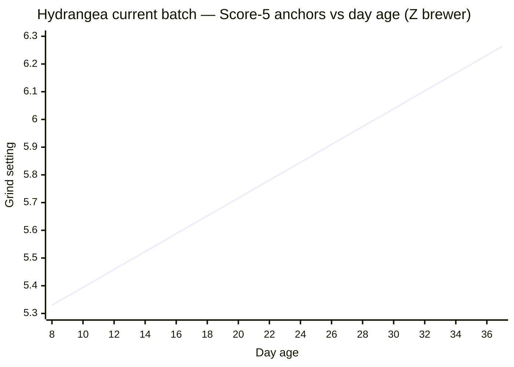
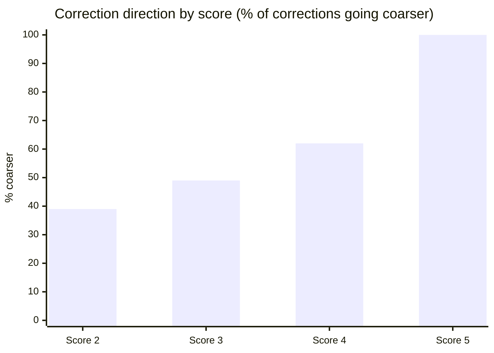
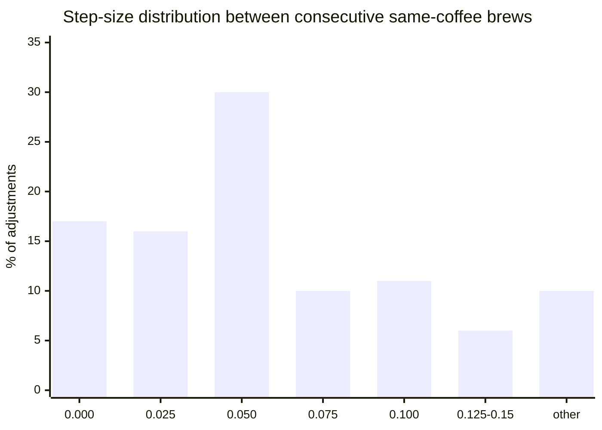
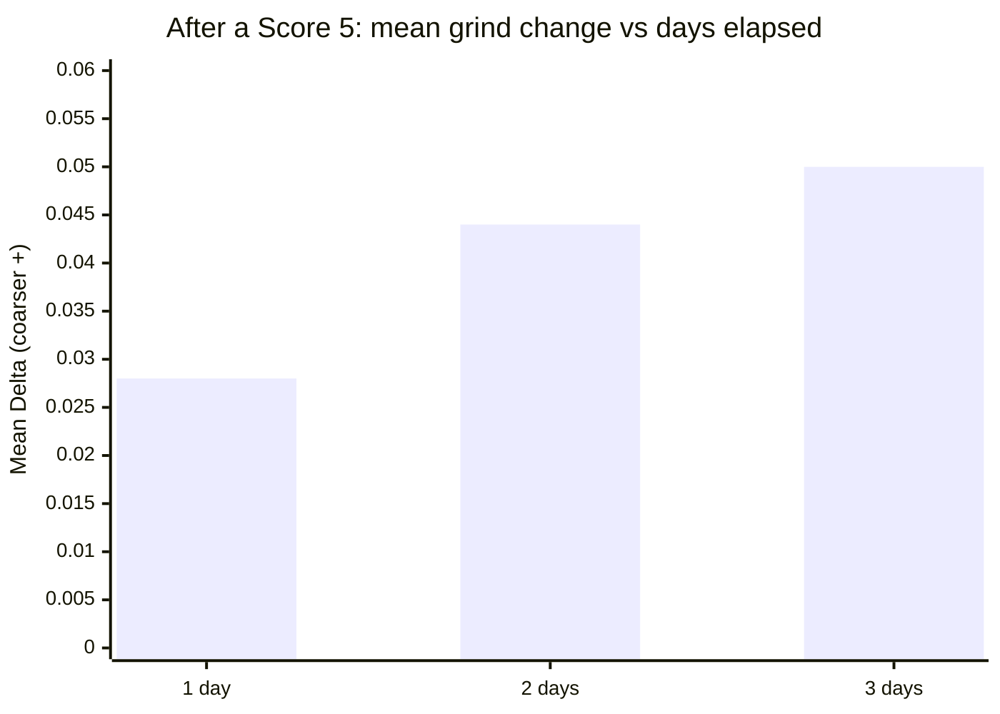
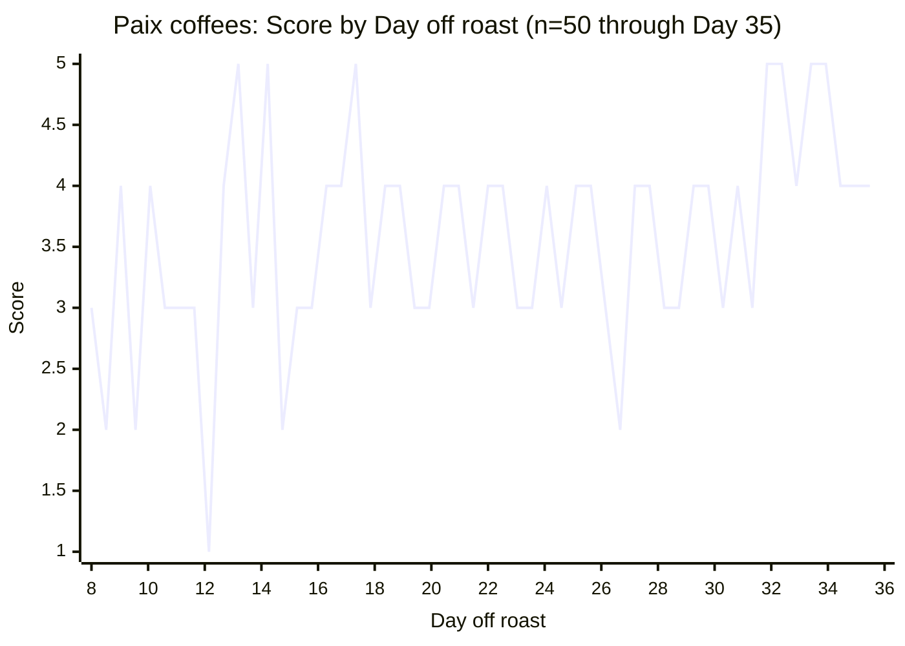
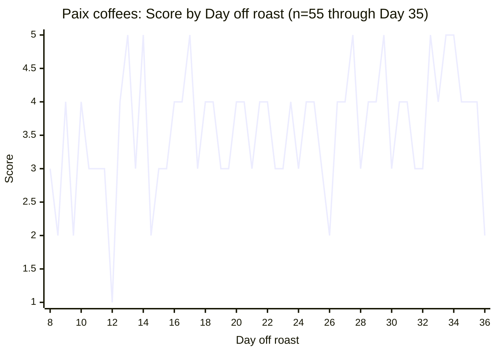
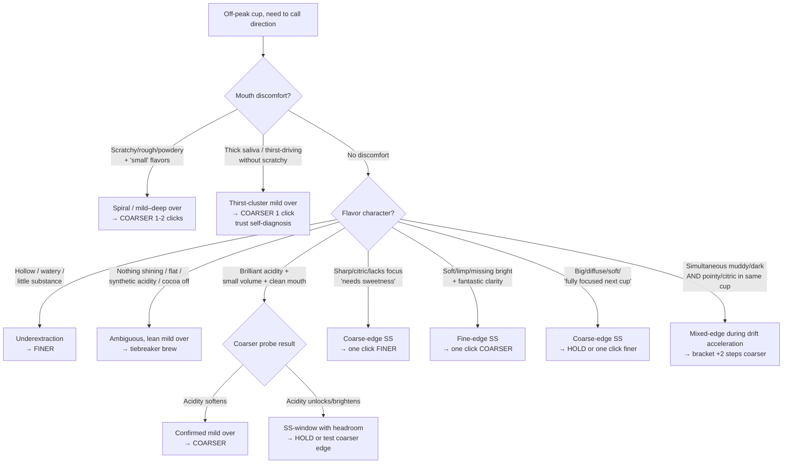
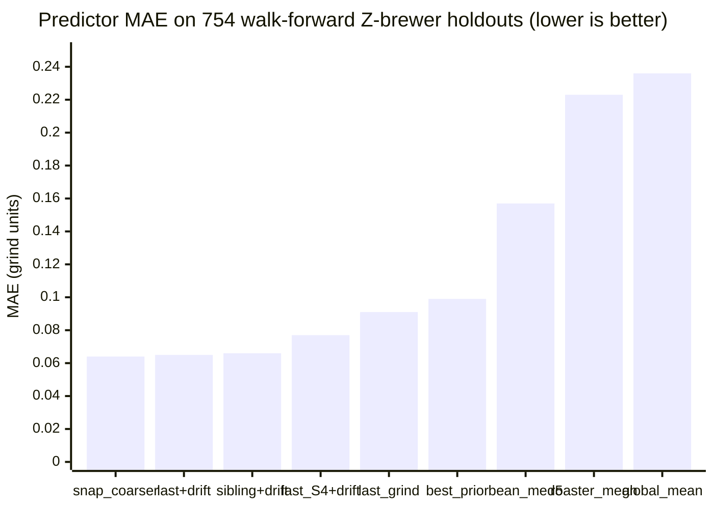

# Coffee Journal — Profile (Joshua)

Calibration file for Joshua's coffee journal. Pair with `AGENT_GUIDE.md` (universal methodology). The guide tells you how to predict; this file tells you the numbers and patterns specific to this journal.

## 1. Scope

- **Brew method**: Pour-over, primarily Z1 (Zerno) with Orea in earlier entries and occasional Aeropress.
- **Roast profile**: Specialty light-roast, often very light (H&S is among the lightest in the world).
- **Journal size**: ~1 year of daily entries, 3800+ lines of `Coffee Journal.md`.
- **Maintainer**: Joshua. Entries are top-to-bottom, earliest to most recent.

## 2. Equipment

- **Grinder**: **Lagom P64** (primary). Occasionally **Comandante C40** hand grinder (settings 24–27 range; incompatible scale with P64 — do not cross-compare numerically).
  - "Lagom" is the grinder brand, not a roaster.
- **Grinder step size (dial increment)**: **0.025** on the dial = 2.5 microns. **All predictions round to 0.025 increments** (e.g., 6.175, 6.200, 6.225).
- **Observed dial-value ranges**:
  - **Z1/Zerno brewer**: ~5.0–7.0+ (most entries fall here).
  - **Orea brewer**: ~6.6–7.3 (earlier entries).
- **Brewer shorthand codes** (appear in entry headers):
  - `O` = Orea
  - `Z` = Z1 (Zerno)
  - Accessories: `M` = Melodrip, `NK` = Negotiated Kalita filters

## 3. Recipe Baseline

- **12.5g coffee / 250g water** at **211°F**, 5-pour method with Melodrip.
- When not otherwise noted in an entry, assume this recipe.

## 4. Water

- **Default**: Custom mineralized water at **15KH / 35GH**. Very low-alkalinity, light on minerals — well below the SCA target of 68GH/40KH — which maximizes brightness and acidity for light roasts at the cost of some body.
- **Variants observed** (flagged explicitly in entries when used):
  - **Crystal Geyser spring water** (~50–72 GH, ~50–55 KH) — shifts sweet spot **~0.05–0.10 coarser** vs. custom. Confirmed: September batch shifted coarser on Crystal Geyser and back down when returning to custom.
  - **Reverse osmosis (RO)** — e.g., Whole Foods store RO. Requires **finer** settings, but the intercept shift is **inconsistent across refills** (TDS 5–50 depending on membrane state). Treat RO entries as **noisier** than custom-water entries — don't let apparent intercept shifts on RO override the consensus curve. One H&S batch 3 instance (Day 56–60) showed several Score 3s on RO that looked like an intercept shift, but a Score 5 at the same setting on the same water disproved it.
- **Rule of thumb**: A water change shifts the sweet spot baseline (intercept). It does **not** shift the drift rate (slope). Once dialed in to a new water, predictions proceed normally from the new anchor.

## 5. Rating Scale

1–5 scale, appended as `Score: X` in headers:

- **5** — Transcendent. Header adjectives that reliably proxy Score 5: "Stunning", "Magical", "Knockout", "Musical", "wow wow wow", "absolutely perfect", "one of the best", "shimmering".
- **4** — Solidly good. "Quite good", "really good", no major flaws.
- **3** — Enjoyable but with obvious flaws.
- **2** — Pretty unenjoyable.
- **1** — Gross/disgusting. Extremely rare.

When scoring is ambiguous or missing from the header, **read the notes** — sentiment in prose is a more reliable signal than the terse header.

## 6. Entry Format

Each entry header follows:

```
## CoffeeName, Brewer, GrindSetting @ Temp, Dose/Water Day X Sentiment, Score: X
Tasting notes and next-setting suggestions.
```

- **Sweet-spot markers**: Joshua typically marks dialed-in cups with `**Sweet spot**` in notes or glowing language ("dialed in", "musical", etc.).
- **"Should have been X"**: Joshua's retrospective corrected estimate of the true sweet spot for that day. Highly valuable for calibration.
- **Day X**: Days since roast date.
- **Same-day brews**: Joshua frequently brews the same coffee multiple times per day. Do not auto-increment Day X — always verify the current date and the latest journal entries before assuming a Day number.

## 7. Roaster Groupings

Coffees are named after producers / farms / creative names. Multiple coffees from the same roaster age similarly and often share the same sweet spot at the same age.

### H&S Roasters

- **Orea era**: Pineda, Vista, Pena, Lasso Mejorado\*, Lopez, San Antonio (decaf)
- **Z1 batch 1**: La Esperanza 2, La Esperanza, Gatomboya, Karani, Iridescence, Kiamwangi, Banko Taratu, Placer
  - Drift **~0.015/day during Day 28–50**, then **accelerates to ~0.035–0.050/day past Day 50** (Placer went from 6.25 at Day 53 to 6.75 at Day 63)
- **Z1 batch 2**: Birthday Cake, Rumudamo (natural + washed)
- **Z1 batch 3 (most recent)**: Trujillo, Lasso, Ninco, Chelbessa
- **Likely H&S**: Karianini, later Paraiso
- Drift rates vary by batch: batch 1 ~0.015/day, batch 3 ~0.023/day
- **H&S batch 3 showed acceleration past Day 58** (~0.033–0.042/day), matching batch 1's late-age pattern. Earlier entries at 6.2–6.25 on Day 59–61 that appeared underextracted were actually overextracted — the overextraction spiral mimicked underextraction with "small, watery" flavors. Going coarser (6.275, then 6.3) improved scores, confirming the acceleration. By Day 63, the sweet spot may be at 6.4+. At this acceleration rate, **use bigger jumps (0.05–0.075) rather than single 0.025 increments** to keep up. The late-age spiral (Day 58–68) cost 24 entries before a Score 5 was achieved again via the bracketing strategy — a cautionary example of how chasing with conservative increments during acceleration wastes brews.

_\*Lasso Mejorado is roasted by Paix, a separate roaster._

### Hydrangea Coffee Roasters

- Uberrimo, Bolanos, Paraiso, Elida, Pena (most recent), La Isabela (natural), Monteblanco (co-ferment)
- Thermal shock processing is a Hydrangea method.
- Z1 sweet spot **~6.0–6.1 around Day 34–40** for the earlier batch (Elida, Bolanos, Uberrimo); fit is sparse (n=5 Score-4+ anchors) but consistent.
- Elida was the standout (multiple Score 5 entries); Uberrimo and Bolanos were subtler and harder to dial in.
- Hydrangea coffees were notably forgiving early (Uberrimo scored 5 on Day 8 on the Orea).
- **Most recent batch** (Pena washed, La Isabela natural, Paraiso thermal shock, Monteblanco co-ferment, all roasted ~March 29, **Day 9–37 closed**): **two-regime drift across the full batch**. Pre-Day-27 segment runs ~0.026/day; post-Day-27 segment accelerates to **~0.035/day** (final refit; six anchor-days from Day 27 to Day 37 fit (6.25 − 5.90) / 10 = 0.035, with cross-checks at D27→D33 = +0.0375, D33→D37 = +0.031, D34→D37 = +0.033). The post-27 rate was first estimated at +0.038/day from a single Day 31→33 window, then refined down to +0.033 with Day 34–36 data, then back up to +0.035 with Day 37 closing the batch. The full anchor sequence: D27 5.90 (4-way S5) → D28 5.95 → D29 5.975 → D30 6.00–6.025 → D31 6.05 → D33 6.125 (3-way S5) → D34 6.15 (sibling SS) → D36 6.20 (3-way S5) → D37 6.25 (Monteblanco S5 + La Isabela correction + blend S5). Three-day rolling slopes wiggle between +0.025 and +0.05/day; the 10-day average is the most stable estimate. Single-line fit across all 41+ Score-5 anchors gives grind ≈ 0.0322·day + 5.072. For prediction past Day 27, **use 0.035/day** (post-27 regime average); for prediction Day 8–27 use 0.026/day.



_Line shows pooled OLS fit (grind ≈ 0.0322·day + 5.072) across Day 8–37. Score-5 anchors (n=41+): D9 5.45, D10 5.45, D11 5.475, D13 5.50, D14 5.50, D15 5.525, D16 5.55, D17 5.575×2, D18 5.60×4, D19 5.625, D19 5.65×2, D20 5.675×2, D24 5.825, D25 5.85, D26 5.875×3, D27 5.90×3, D28 5.95, D29 5.975, D30 6.00, D30 6.025, D31 6.05×2, D33 6.125×2 (+ Paraiso correction), D34 6.15 (+ La Isabela correction), D36 6.20×3 (Monteblanco, Pena, Paraiso), D37 6.25 (Monteblanco + blend; La Isabela correction confirms). Pooled fit splits two regimes: pre-Day-27 ~0.026/day, post-Day-27 ~0.035/day._

- The roaster's approach dominates over processing method for baseline setting — all four coffees share the same trajectory. **They differ in _how they fail_ past the sweet spot (per-coffee coarse- and fine-edge vocabulary, see §13), not in drift rate.** Earlier §8 language about "three regimes", "acceleration past Day 20", or "CO₂ phase ending Day 14–15" overstated what are really day-to-day wiggles around one slow trend. Drift is slow and generally predictable; batch behaviour should be assumed similar across batches unless a clean multi-week falsification appears.
- **Windowed (3-day) slopes do wiggle** between ~0.013/day and ~0.035/day, but these swings are within noise of the overall +0.030/day fit and coincide with sampling density, not genuine regime change. Treat them as noise, not signal.
- **Sweet-spot anchors along the trend**:
  - Day 9–11: **~5.45–5.48** (Score 5: La Isabela D9, Monteblanco D10, Pena D11)
  - Day 13–15: **~5.50–5.53** (Score 5: Paraiso D13, Monteblanco D14, Paraiso D15)
  - Day 16–18: **~5.55–5.60** (Score 5 across all four)
  - Day 19–20: **~5.625–5.675** (Score 5 across all four)
  - Day 22–23: **~5.75–5.80** (sparser, see per-coffee triangulation below)
  - Day 24–26: **~5.825–5.875** (Score 5: Pena D24+D26, Monteblanco D25, Paraiso+Pena D26)
  - **Day 27 (4-way 5.90 cluster)**: Monteblanco, Pena, Paraiso, La Isabela all Score 5 at the same setting on the same day — strongest single-day batch convergence event in the entire journal.
  - **Day 28**: La Isabela 5.925 → S4 ("losing brightness, barely rough"), Monteblanco 5.95 → S5. The bracket places true Day-28 SS center at ~5.94, slightly ahead of the +0.030/day trend prediction (5.93). One click of acceleration over a single day is within noise; not yet a regime claim.
  - **Day 29–30**: La Isabela D29 5.975 → S5 ("tight, bright, zingy purple grape, a bit toyish"); Monteblanco D30 6.00 → S5; Paraiso D30 backstep test at 5.80 → S4 ("a little weaker"), then walked back to 6.025 → S5 ("excellent first sip, open, gentle, expressive, soft peach gummy"). The 6.025 anchor falls +0.039 above the trend prediction (5.99) — the largest residual past Day 25 and the only one >+0.025. Pena D30 6.00 → S4 begins a divergent walkback that breaks Pena from the four-coffee consensus.
  - **Day 31 (sibling SS at 6.05)**: La Isabela 6.05 → S5 ("crisp, fruits and sweetness nicely poised and clean through cooldown"); Monteblanco 6.05 → S5 ("clean soapy-like passionfruit, purplish, sweet-tart"). Both land +0.030 above the (refit) trend prediction of 6.020 — the +0.030–0.040 residual cluster past Day 27 is now consistent enough to flag as systematic late-life acceleration rather than noise. Pena was not brewed Day 31 (skipped after Day 30 S4).
  - **Day 32 (all-S4 day at +1-step settings)**: Pena 6.075 → S4 ("muddy/dark + pointy/citric"), La Isabela 6.075 → S4 ("crisp but flavors held back, jasmine, strangely moderate, heavy finish"), Monteblanco 6.075 → S4, Paraiso 6.10 → S4 ("soft glow falls off, expansiveness grows, peach gummy out of focus"). All four coffees scored 4 at the conservative +1-drift-step setting from Day 31's 6.05 SS. The vocabulary is mostly fine-edge ("flavors held back, moderate, muddy/dark, soft, out of focus") with mild coarse-edge tells in Paraiso. **Initial reading was wrong**: I diagnosed Pena as "bean aged out" (mixed-edge) and Paraiso as "coarse-edge SS-center 6.075". Day 33 falsified both — see below.
  - **Day 33 (regime-shift confirmed at 6.125)**: Monteblanco 6.125 → S5 ("soapy purple passionfruit, sweet, juicy, almost tight at times, exciting"); Pena 6.125 → S5 ("soft, spicy, very sweet, single-minded sweet luxury"); Paraiso 6.15 → S4 ("very soft, slightly watery, far-off funky peach gummy, out of focus" → user correction 6.125). All three coffees converge on a Day-33 SS-center of **6.125**. Drift D31→D33 = (6.125−6.05)/2 = **+0.0375/day**, sharply faster than the +0.030 residual cluster I'd been using. **This is the cleanest multi-day cross-coffee acceleration falsification of the single-trend assumption** — promote post-Day-27 to a distinct regime at ~0.038/day.
  - **Pena resurrection lesson**: Day 32 Pena S4 mixed-edge vocabulary at 6.075 was diagnosed as "bean aged out, stop chasing." Day 33 Pena S5 at 6.125 (one extra coarsening step beyond +1) shows the bean was **not aged out** — its window had narrowed but the SS-center had moved past +1-step. The "mixed-edge" vocabulary was a fine-edge cup with residual coarse-edge citric character, not a true narrowing-window mixed-edge. **Lesson**: don't declare a coffee "out of window" from a single off-bracket reading; bracket coarser with a +2-step jump (0.050) per the H&S batch-3 acceleration playbook before concluding the bean is done.
  - **Day 34 (sibling SS at 6.15)**: Monteblanco 6.15 → S5 ("absolutely lovely flavors and balance"); La Isabela 6.175 → S4 ("a little underextracted, glow and finish falls off") with user correction to 6.15. Drift D33→D34 = +0.025/day, matching the pre-Day-27 rate rather than the +0.038 Day 31→33 estimate — first signal that the +0.038 was a noise-amplified 2-day window rather than the true post-27 rate.
  - **Day 35 (4-coffee fine-edge cluster at 6.20)**: Pena 6.20 → S4 ("gentler, weaker side, more September-like, less H&S/Sey"); Paraiso 6.20 → S4 ("lovely funky peach gummy, barely grainy/scratchy in cooldown, leaning 6.175"); La Isabela 6.20 → S4 ("delicate grape candy, perhaps barely more delicate than it could be, leaning 6.175"). Three sibling coffees converge on the same fine-edge "lean 6.175" reading — looks like a stalled-drift signal arguing the Day-35 SS-center is 6.175, not 6.20. **Day 36 falsifies this** (see below).
  - **Day 36 (3-way SS at 6.20 — second batch convergence event)**: Monteblanco 6.20 → S5 ("lovely sweet cup, flavors melded, easy to drink"); Pena 6.20 → S5 ("decadent yet focused, sugary tea, English breakfast with sugar and cream, less eucalyptus, more cocoa, more tea complexity — best cup of this version"); Paraiso 6.20 → S5 ("quite good!"). Three of four siblings at S5 on the same setting, same day — second-strongest batch convergence event in the batch (after Day 27's 4-way 5.90 cluster). Three lessons: (a) the Day-35 4-coffee S4 cluster at 6.20 with overlapping "lean 6.175" vocabulary was a one-day stalled-drift wobble, not a real center shift — second clean prototype of the §11 stalled-drift false alarm pattern (after the Day-21 case); (b) Pena's narrower-window concern from Day 32–33 is **not** a per-coffee center bias — Pena tracks Monteblanco's center precisely when given the right setting; (c) Day 27→36 cross-day drift averages (6.20 − 5.90)/9 = **+0.033/day**.
  - **Day 37 (closing the batch at 6.25)**: Monteblanco 6.25 → S5 ("absolutely lovely, substantial melded flavors, refreshing passionfruit, finish goes on forever"); La Isabela 6.225 → S4 ("heavy perfumy grape, hollow flavor lacks immediacy, luxurious" — classic La Isabela underextraction signature) with user correction to **6.25**; 4-way blend 6.25 → S5 ("lovely last cup!"). Drift D36→D37 = +0.05 in one day (sibling SS jumped 6.20 → 6.25), faster than the +0.033 regime-rate average and mirroring the Day-35 wobble in the opposite direction. The 10-day post-27 average refines to **+0.035/day** (D27→D37: (6.25 − 5.90)/10 = 0.035), making +0.035/day the final post-Day-27 regime estimate. End of Hydrangea batch.
  - **Hydrangea batch retrospective (Day 9–37)**: Two regimes confirmed and stable: pre-Day-27 +0.026/day, post-Day-27 +0.035/day. Three batch convergence events (Day 27 4-way @ 5.90, Day 33 3-way @ 6.125, Day 36 3-way @ 6.20). Two stalled-drift false alarms (Day 21 opposite-sign hidden, Day 35 fine-edge wobble) — both now profiled in §11. One late-life narrowing-window scare (Pena Day 32 mixed-edge → Day 33 S5 at +2 steps) profiled in §13. Final blend (4-way) at center landed S5 — single data point, but suggests a 4-way Hydrangea blend at the batch SS-center reads at peak. **End-of-batch lesson**: this batch's drift behaviour was the single most predictable in the journal once the two-regime structure was identified, with same-day sibling consensus consistently the strongest single anchor (stronger than own-coffee history when ≥2 siblings agree).
- **70% Score-5 rate on Days 8–20 with zero Score 3s** — best-performing stretch in the journal by a wide margin, consistent with a well-characterised single trend in a cold-start-friendly roaster profile.
- **Day 21–23 score drop is drift-outrunning-grinder-resolution, not batch disintegration**: 0.025 grinder step vs. a ~0.029/day true rate means roughly one in three days will land a click off-center. Flavors stay clean and varietal through the drop; see "Score-rate collapse as a drift-regime signal" in the guide.
- **Per-coffee coarse-tolerance emerges at the edges of the SS window, not as divergent drift**:
  - **Day 21** three-way drop at 5.7: Pena mild over, La Isabela genuinely under, Paraiso ambiguous. Same setting, opposite signs. Resolved by tiebreaker (Pena finer at 5.675 → Score 3 with overextraction spiral signals, confirming mild over at 5.7).
  - **Day 22** four-way Score-4 at 5.75: all four share a ~5.74–5.75 SS center; they differ in how they fail past it. La Isabela + Paraiso stay bright/loose (coarse-tolerance with varietal-acidity headroom); Monteblanco reads soft/limp (fine-edge SS, one click fine of center); Pena reads sharp/citric (coarse-edge SS). See §13 for full fingerprints.
  - **Day 23** triangulation landed a shared center of ~5.785–5.79 — consistent with the +0.028/day trend from Day 22's ~5.75.
  - **Late-life Pena (Day 27→33) — narrowing window, not aging out**: Pena's S4-string at 5.85, 6.00, 6.075 from Day 27→32 (with 5.85 historical, the others current batch) was initially diagnosed as a divergent walkback-finer, then as "bean aged out" at Day 32. Day 33 Pena S5 at 6.125 (one extra step coarser than +1) **falsifies both diagnoses** — Pena was tracking the same accelerated late-life trend as its siblings, just outside the +1-step bracket. The window appears narrower than its siblings' (one click finer or coarser than 6.125 may not score 5), but the bean is still in productive territory. **For prediction**: when a single coffee in a batch lags the sibling consensus by 1 click and reads with mixed-edge vocabulary, **try +2 steps** before concluding it's aged out.
- **Calibration lesson** (Day 21): Same-day parallel drops with overlapping off-peak vocabulary can hide opposite-sign diagnoses. See §11 "Stalled-drift false alarm."
- **Reference-anchor bias**: "small flavor volume" in late-life cups (Day 22+) compared against Day 9's peak perfuminess is often perceptual, not extraction-based. Fresh-coffee CO₂ lift and perfuminess fade regardless of grind. If other markers are sweet-spot-coded (loose, defined acidity, honest flavors, clean mouthfeel), the cup is likely peaking for its age.

### September Coffee

- **Core washed batch**: Pena (Z1), Morena, Bermudez, Velasco, Lasso (Sep), Castillo, Cuenca, Ortega, Pintado, Danche, Chelbesa
- **Creative/processed**: White Honey, Gingerbread, Putushio, Tamana/Tamama
- **Producer-named other**: Buttercream, Sudan Rume, Fajardo, Martinez, Rojas
- Three distinct drift tiers:
  - **Core washed**: **~0.015/day** — very tight clustering, 11 coffees within ~0.1 of each other.
  - **Creative/processed**: **~0.027/day linear**, but **decelerates** from ~0.036 to ~0.020/day — converges with washed rate by Day 40. Likely honey/natural/anaerobic processing → more soluble compounds → faster early aging. Peaked early (Score 5s only through Day 25).
  - **Producer-named other**: **~0.013/day** — slowest, noisiest, hardest to diagnose. Most overextraction-spiral incidents came from this group. Only 1 Score 5 across ~90 entries (Buttercream Day 26). Diagnosis accuracy ~50–55% — lean heavily on sibling data for these coffees.

### Moonwake Coffee Roasters

- Serrato, Gomez, Ramirez, Benitez
- Drift: **~0.025–0.029/day**
- Sweet spots are notably **higher** than other roasters at the same age (~6.6–6.7 at Day 50).
- Tightest convergence of any roaster batch — all four within 0.05 of each other at key ages.
- Benitez is the most stable/distinct (vivid raspberry, almost never misdiagnosed); Serrato the most polarizing ("not my favorite profile" but well-executed).

### SEY

- Muhito, Dota, Gotiti, Botina (Bonita) (Sept–Oct 2025 batch); Guchienda (washed Kenyan, roast May 11 2026), Alba (pink bourbon, roast May 13 2026), Bermudez (Colombian chiroso, Jhon Alexander Bermudez, pineapple/bright acidity/hops, roast May 13 2026), Meza (gesha, roast May 13 2026)
- "SEY grassy/spicy quality", "SEY citric spiciness"
- Drift: **~0.020/day**
- These coffees were erratic and hard to dial in on the Z1.
- **Narrow sweet spot window** (~0.35 range vs. ~0.5+ for Hydrangea) and **misleading astringency** — they read as underextracted (tight mouth, green qualities) even when overextracted, leading to repeated finer adjustments that made things worse.
- **Highest overextraction spiral vulnerability of any roaster** (~15% of entries hit the "small + mouthfeel" dual pattern).

### Other

- **Paix**: Lasso Mejorado (historical, Orea era), and a recent set — Blue Strudel (natural Ethiopian), Blossom Wine (double-ferment washed Ethiopian), Amber Drop, Floral Standard (Andres Martinez washed Gesha, Cauca, Colombia). **Roast dates**: Blue Strudel / Blossom Wine / Amber Drop = **Apr 17 2026**; Floral Standard = **Apr 21 2026**. **Two-regime drift** confirmed by the full Day 10–35 dataset:
  - **D16–D27 (mid-life)**: per-coffee slope **0.062–0.073/day** — among the fastest in the journal, ~2× H&S/Hydrangea pre-acceleration rate.
  - **D27+ (late-life)**: slope flattens to **~0.025/day batch-wide**, similar to AD's, FS's, and Blue's D27→D33 anchors all moving at 0.025/day. (Hydrangea accelerated late-life; Paix flattens — opposite signal.)
  - **D10–17 (under-rested)**: do not fit; cups read metallic-roasty (Ethiopians) or hollow-hazy (Gesha), see §11. First S5 anchors land at D19–21 (FS D19 6.00, AD D20 5.80, FS D21 6.025).
- **Per-coffee fan-out at equal days-from-roast** narrows late-life as slopes converge. Mid-life fan was ~0.18 grind units at D25 (AD 6.15, Blue 6.19, Blossom 6.21, FS 6.33). Late-life D31 anchors: AD 6.425 S5, Blue 6.55 S5, Blossom 6.45 S4 (SS ~6.45), FS 6.45 (predicted, brewing now) — fan ~0.10–0.13 grind units. **Predict each Paix coffee from its own intercept using the regime-appropriate slope.**
- **Blossom Wine**: not a hard S3 ceiling. Original "ceiling caps at S3" claim (D11–D30, peak S3 across 1.00 grind units) was falsified by **D31 6.45 → S4** ("settled/melded, sweet, tea-toned, somewhat luxurious") and **D32 6.60 → S4** ("loose, semi-focused, 6.575?"). Revised reading: **narrow + intermittent productive window late-life**; the defect-signature descriptors ("gross/green/roasty/silty/metallic") still return outside the window (D35 6.65 → S2 "gross, green, mouth discomfort"). Predict via batch-curve offset (+0.05 from AD late-life), expect ±1 click sensitivity, don't be surprised by an S2 outside the window.
- **Two-regime per-coffee fits**:

  | Coffee          | Mid-life (D16–D27) | Late-life (D27+) | Late-life intercept | Pred. SS @ D30 | Pred. SS @ D35 |
  | --------------- | ------------------ | ---------------- | ------------------- | -------------- | -------------- |
  | Amber Drop      | 0.073              | **0.025**        | 5.65                | 6.40           | 6.525          |
  | Blue Strudel    | 0.062              | **0.025**        | 5.775               | 6.525          | 6.65           |
  | Blossom Wine    | 0.068              | **0.025**        | 5.675               | 6.425          | 6.55           |
  | Floral Standard | 0.063              | **0.025**        | 5.675               | 6.425          | 6.55           |

  All late-life intercepts derived from D31–D32 S5/S4 anchors (AD D31 6.425 S5; Blue D31 6.55 S5; Blossom D31 6.45 S4 ≈ SS; FS D27 6.35 S5). Linear mid-life model extrapolated past D27 overshoots by 0.10–0.20 by D33 — **do not extrapolate the mid-life slope past D27.**
- **Practical rules**:
  - When the most recent anchor is D27+, drift-forward at **0.025/day** from that anchor (don't refit intercept from older mid-life data).
  - The mid-life intercepts in profile.md history (AD 4.320, Blue 4.637, Blossom 4.51, FS 4.78) were correct for D16–D27 predictions; use the late-life intercept above for D27+.
  - "Similar" between coffees = window width + flavor legibility, not SS-center. AD and FS share legibility but sit ~0.13 apart late-life; Blue and Blossom share narrow-window character but no SS proximity.
- **Norena**: Roaster unknown.

**Important naming clash**: "Lasso", "Pena", and "Paraiso" each appear under multiple roasters at different points in the journal. Use journal position and context to determine which is which. A "Lasso" entry early in the journal (Orea, Paix) is a completely different coffee than one later (September Coffee Z1) or the most recent (H&S Z1).

## 8. Drift-Rate Table (Summary)

| Roaster / Batch                | Drift/Day  | Notes                                                                                                                                                                                                                                                                                                                                                                                                                                                                                                                                                                                                                                                                        |
| ------------------------------ | ---------- | ---------------------------------------------------------------------------------------------------------------------------------------------------------------------------------------------------------------------------------------------------------------------------------------------------------------------------------------------------------------------------------------------------------------------------------------------------------------------------------------------------------------------------------------------------------------------------------------------------------------------------------------------------------------------------- |
| September (core washed)        | ~0.017     | Very consistent across coffees                                                                                                                                                                                                                                                                                                                                                                                                                                                                                                                                                                                                                                               |
| September (creative/processed) | ~0.029 avg | Gingerbread, White Honey; decelerates from ~0.036 to ~0.020                                                                                                                                                                                                                                                                                                                                                                                                                                                                                                                                                                                                                  |
| September (producer other)     | ~0.012     | Fajardo, Martinez, Rojas, Sudan Rume, Buttercream; slow, noisy                                                                                                                                                                                                                                                                                                                                                                                                                                                                                                                                                                                                               |
| H&S batch 1                    | ~0.015     | Karani, Gatomboya, Iridescence; **accelerates to 0.035–0.050 past Day 50**                                                                                                                                                                                                                                                                                                                                                                                                                                                                                                                                                                                                   |
| H&S batch 3                    | ~0.018     | Trujillo, Lasso, Ninco, Chelbessa; **accelerates to ~0.033+ past Day 58**                                                                                                                                                                                                                                                                                                                                                                                                                                                                                                                                                                                                    |
| Hydrangea (earlier batch)      | ~0.018     | Elida, Bolanos, Uberrimo. Sparse Score-4+ anchors (n=5); informed prior, low confidence.                                                                                                                                                                                                                                                                                                                                                                                                                                                                                                                                                                                     |
| Hydrangea (most recent batch)  | ~0.026 (Day 9–27), accelerates to ~0.035 (Day 27+) | Pena, La Isabela, Monteblanco, Paraiso, **batch closed at Day 37**. **Two-regime drift** confirmed across the full batch. Post-27 rate estimated at +0.038/day from a single Day 31→33 window, then refined down to +0.033 with Day 34–36 data, then back up to **+0.035** with Day 37 closing the batch (D27→D37: (6.25 − 5.90)/10 = 0.035). Three batch convergence events: Day 27 4-way @ 5.90, Day 33 3-way @ 6.125, Day 36 3-way @ 6.20. Two stalled-drift false alarms profiled in §11 (Day 21 opposite-sign hidden, Day 35 fine-edge wobble). Pooled linear fit across 41+ Score-5 anchors: grind ≈ 0.0322·day + 5.072. All four coffees share trajectory; per-coffee differences are vocabulary-at-the-edges only (see §13). **Same-day sibling consensus is the strongest single anchor in this batch — stronger than own-coffee history when ≥2 siblings agree.** Final 4-way blend at center landed S5 (single data point, encouraging signal for blend-at-center behaviour). **For prediction past Day 27, use 0.035/day**; for Day 8–27 use 0.026/day. See §7. |
| Moonwake                       | ~0.024     | Serrato, Gomez, Ramirez, Benitez                                                                                                                                                                                                                                                                                                                                                                                                                                                                                                                                                                                                                                             |
| Sey                            | ~0.025     | Muhito, Dota, Gotiti, Botina/Bonita (Sept–Oct 2025 batch); Guchienda (washed Kenyan, roast May 11 2026), Alba (pink bourbon, roast May 13 2026), Bermudez (Colombian chiroso, roast May 13 2026), Meza (gesha, roast May 13 2026). Per-coffee slope cluster 0.023–0.030/day across 6 coffees with ≥3 anchors each (Bermudez-old non-SEY excluded). Cross-coffee intercept fan-out ~0.15 grind units at equal day. Narrow window, S3 modal outcome (>50% of all SEY entries). 6 Score-5 anchors total across n≈62 Z-brewer entries: low cluster D7–D10 5.65–5.675 (current batch, n=4), high cluster D22–D27 5.9–5.95 (old batch, n=2), zero S5s D11–D21 across the full dataset. Two coffees (Dota, Botina) never reached S5 across ~23 combined entries. |
| Paix                           | **~0.067** (n=24, per-coffee avg through D29) | Blue Strudel, Blossom Wine, Amber Drop, Floral Standard. **Drift rate is ~2× the H&S/Hydrangea pre-acceleration norm**, faster than any other current roaster. Per-coffee slopes (refit through D29): AD 0.073 (n=9), FS 0.063 (n=6), Blue 0.062 (n=4, retired the inflated n=3 0.081 fit), Blossom 0.068 (n=5). **Per-coffee SS fan-out ~0.18 at D25**: Amber Drop finest (6.15), Blue Strudel (6.19), Blossom Wine (6.21), Floral Standard coarsest (6.33). Blue Strudel and Blossom Wine swapped middle-pack positions in the 2026-05-16 refit. Predict each Paix coffee from its own slope + intercept; do not pool. Blossom Wine confirmed roast-side defect (trajectory tracks batch, ceiling caps at S3; D29 6.50 cleanest descriptor). Prior +0.0125/day estimate from a 2-day window was wrong — see §7. |

### Per-roaster Score-5 anchors (Z brewer)

Score-5 anchors used for the OLS fits above. Mermaid `xychart-beta` doesn't support scatter, so the raw points are listed instead — the fit slope is what matters for prediction; the cluster shape is what matters for sanity-checking the fit.

**H&S batch 3** (Trujillo, Lasso, Ninco, Chelbessa) — fit: `grind = 0.018·day + 5.30`

| Day | 19   | 48   | 50   | 54    | 55    |
| --- | ---- | ---- | ---- | ----- | ----- |
| S5  | 5.65 | 5.95 | 6.00 | 6.125 | 6.125 |

Late-age Score-3 string (Day 58–68) sits above the trend, signaling acceleration past Day 58 — see §7 H&S narrative.

**Hydrangea earlier batch** (Elida, Bolanos, Uberrimo) — sparse anchors (n=2 S5 + 3 S4), fit assumed at +0.018/day informed by the current batch's structure.

| Day | 34  | 37  |
| --- | --- | --- |
| S5  | 6.0 | 6.1 |

**Moonwake** (Serrato, Gomez, Ramirez, Benitez) — fit: `grind = 0.024·day + 5.33`

| Day | 21  | 52    | 54    | 60    |
| --- | --- | ----- | ----- | ----- |
| S5  | 5.8 | 6.625 | 6.675 | 6.775 |

Tightest convergence of any roaster batch (Score-4 cluster within 0.05 of each other at every age).

**September washed core** — fit: `grind = 0.017·day + 5.42`

| Day | 15  | 17   | 29  | 30    | 31   | 38    | 43  | 44  | 45   | 54    | 56    |
| --- | --- | ---- | --- | ----- | ---- | ----- | --- | --- | ---- | ----- | ----- |
| S5  | 5.6 | 5.65 | 5.8 | 5.825 | 5.85 | 5.975 | 6.1 | 6.1 | 6.15 | 6.125 | 6.375 |

Densest Score-5 carpet of any roaster — eleven coffees with similar drift make this the most predictable group.

**Sey** (Z brewer, Comandante excluded) — per-coffee slope cluster `0.023–0.030/day`; SEY-group typical slope ~0.025/day

| Day | 8    | 9    | 10    | 22  | 27   |
| --- | ---- | ---- | ----- | --- | ---- |
| S5  | 5.65 | 5.65 | 5.675 | 5.9 | 5.95 |

6 Score-5 anchors total across ~62 Z-brewer entries (n=9 coffees, all batches; Bermudez-old removed as non-SEY). Two distinct S5 clusters: **low** D7–D10 5.65–5.675 (current batch — Alba D8, Bermudez D8, Guchienda D9/D10; n=4) and **high** D22–D27 5.9–5.95 (Sept–Oct 2025 batch — Gotiti D22, Muhito D27; n=2). **Zero S5 anchors D11–D21** across the full SEY dataset. Score-4 cluster spans D7–D45 across the batches; per-coffee grind-vs-day slopes are tightly clustered (Muhito 0.023, Dota 0.025, Gotiti 0.025, Botina 0.025, Guchienda 0.030, Bermudez-new 0.025), but per-coffee intercepts fan out ~0.15 grind units at equal day. **Score is non-monotonic with grind** within each coffee — same coffee at same setting can score S3 / S4 / S5 on different days. **Two coffees (Dota, Botina) never produced S5** across ~23 combined entries D7–D45. The current batch produces S5 below D22 at much higher density than any prior SEY batch in the journal (4 S5s in 10 entries vs. zero S5s in ~49 entries D7–D21 across prior batches).

**First SEY same-day batch convergence event (D10, 2026-05-23).** Four current-batch coffees brewed within 1 click of each other on the same calendar day produced opposite-end-of-spectrum diagnostic signatures that bracket the batch SS-center:

| Coffee     | D10 grind | Score | Direction       | Diagnostic descriptors                                                    |
| ---------- | --------- | ----- | --------------- | ------------------------------------------------------------------------- |
| Guchienda  | 5.675     | 5     | center          | "super tart, exciting, open texture, stunning cooldown"                   |
| Alba       | 5.675     | 4     | fine-edge / over | "calm berry acidity, scratchy, tight and small vs open, juniper spice grows" |
| Bermudez   | 5.700     | 4     | coarse-leaning  | "a little darker toned, not as explosive, slightest scratchiness"         |
| Meza       | 5.725     | 3     | clear under     | "soft, vague, lost most distinct flavors, scratchy, cooldown hints only"  |

This is the first multi-coffee same-day grind-spectrum SEY observation in the journal. The bracket places the batch SS-center at **~5.6875–5.70 at D10**; per-coffee window-width (not per-coffee SS-center) explains most of the score variation. **Cross-coffee intercept fan-out narrows to ~±0.025 within the current batch** — much tighter than the all-batches ~0.15 estimate (which pooled across Sept–Oct 2025 and May 2026 batches). The Meza D9 self-diagnosis "5.7?" came from an over-leaning cup; acting on it produced a clear-under cup at D10 5.725 — **a clean prototype of the SEY misleading-astringency trap profiled in §11**.

**Current SEY batch trajectory (D7–D15, Z brewer, 2026-05).** Three regimes, revised after the D14/D15 cross-coffee anchor at 5.8 falsified the earlier plateau model:

- **D7–D10 (early-life CO₂-masked window)**: slope **+0.030/day**, anchors 5.60→5.69. Per-coffee fan-out ~0.025. CO₂ in the bed throttles extraction, masking the post-rest "real" center.
- **D10→D11 (CO₂-degas step-shift)**: one-day batch-center jump of **~+0.07 grind units** (5.69→5.76). The single largest one-day batch movement in the dataset. Per-coffee shift timing is asynchronous.
- **D11–D14 brief slow-drift (~+0.005/day) — then D14→D15 second step-shift**: Initial reading of D11–D14 was a flat plateau (~5.76 batch center). The **D14/D15 four-coffee 5.8 anchor falsified this**: Alba D14 5.8 S5 ("sweet spot or 5.825"), Bermudez D14 5.8 S4 (thirst + muted, wants brighter), Guchienda D15 5.8 S4 (dark/powdery cooldown). Three coffees at 5.8 all calling for coarser puts the D14/D15 batch center at **~5.825–5.85**, ~0.06–0.08 coarser than the plateau model predicted (5.755–5.765). The bean has degassed past a second threshold, opening a wider SS-center window than D11–D13 anchored. Working model: a **second step-shift around D13→D14** (~+0.06 over 1–2 days), then likely a new plateau or slow drift D15+. **Two-step-shift trajectory matches community evidence** (§11) that SEY bean fully rests at ~3 weeks; the May 2026 batch is compressing the rest window into a series of step-shifts rather than a single discontinuity.

Score-weighted per-day centers (updated D14/D15):

| Day | n | Weighted grind |
| --- | - | -------------- |
| 7   | 1 | 5.600          |
| 8   | 3 | 5.650          |
| 9   | 3 | 5.658          |
| 10  | 4 | 5.686          |
| 11  | 3 | 5.759          |
| 12  | 3 | 5.765          |
| 13  | 1 | 5.750          |
| 14  | 2 | 5.81 (Guchienda 5.775 S5 + Alba/Bermudez 5.8 S5/S4 cluster, revised upward to reflect coarser-leaning self-diagnoses) |
| 15  | 1 | 5.825 (Guchienda 5.8 S4, wanting +0.025–0.05) |

**Per-coffee offsets from D14+ batch center**: Guchienda ≈ batch −0.025 (finest); Bermudez 0 (center); Alba 0 to +0.0125 (coarsest by a hair). Fan-out ~0.025–0.0375, same as pre-shift. **Predict each current-batch SEY coffee from the batch trajectory ± its post-CO₂ offset.**

**Forward predictions under the two-step-shift model:** D16 batch center ~5.85, D17 ~5.85–5.875, D21 ~5.875+. Past D21, watch for either a return to historical D22+ SEY behavior (S5 cluster ~5.9 from prior batches) or a third step-shift. Treat predictions D16+ as ±0.025 uncertain until next anchor confirms.

## 9. Correction Bias

Holdout count of "should have been X" annotations across the journal (n = 457):

| Score of brew | Coarser         | Finer | Same | Mean Δ     |
| ------------- | --------------- | ----- | ---- | ---------- |
| 2             | 39 %            | 57 %  | 4 %  | +0.005     |
| 3             | 49 %            | 49 %  | 2 %  | +0.011     |
| 4             | **62 %**        | 36 %  | 2 %  | +0.021     |
| 5             | **100 %** (n=8) | 0 %   | 0 %  | +0.047     |
| **All**       | **53 %**        | 46 %  | 2 %  | **+0.014** |



The previously-cited "67 % coarser" figure was wrong — overall the corrections are essentially symmetric (53 / 46). The coarser bias is **score-conditional**: it only emerges once the cup is already close (Score 4+), where it represents drift-tracking, not error-correction.

**Implication:** "When ambiguous, round coarser" applies after a Score-4-or-better brew. After a Score-2-or-3 brew, the direction is genuinely uncertain — diagnosis matters more than a default bias.

**Refinement (Paix D25 Floral Standard miss, 2026-05-16):** the coarser-bias is only a bonus to apply when the most recent S4 anchor read **fine-edge** (tight in mouth at cooldown + shrinking or thin flavors). If the most recent S4 read **coarse-edge** ("soft, can this be pushed?", "great flavors but slightly loose", "muted"), then **drift-forward alone is the prediction — do not add a §9 coarser bonus on top.** Doing so double-counts the coarse-side movement: the anchor's own "push coarser" hint is already a half-step of drift built into the prior cup, and forward-projecting at the per-coffee slope captures the rest. Adding §9 on top puts the prediction past the coarse edge of the window. _Miss case_: FS D23 @ 6.20 read "great flavors, slightly soft, can this be pushed?" — that's a coarse-edge S4. Predicted D25 @ 6.35 with §9 bias applied → S3 "great flavor volume but underdeveloped + scratchy + notably coarser than it should be". Drift-forward without bias (6.20 + 2 × 0.063 = 6.33; or from the cleaner-center D23 @ 6.15 anchor, 6.15 + 2 × 0.063 ≈ 6.275) would have landed 6.275–6.30, matching Joshua's correction.

## 10. Step-Size Distribution

Between consecutive entries of the same coffee on the Z brewer (n = 787), Joshua's grind adjustments:

| Step       | % of adjustments |
| ---------- | ---------------- |
| 0.050      | 30 %             |
| 0.000      | 17 %             |
| 0.025      | 16 %             |
| 0.100      | 11 %             |
| 0.075      | 10 %             |
| 0.125–0.15 | 6 %              |
| other      | 10 %             |



A **one-click (0.025) miss is meaningful but not large** — it's inside the sweet-spot window most of the time. A 0.05 miss is the typical "noticeable" adjustment. 17 % of consecutive entries keep the setting the same (drift-tracking at the window's center, or a re-brew for confirmation). The 10 % at 0.075 is a meaningful bucket: when bracketing or chasing a fast drift, Joshua reaches for three-click jumps before going to a half-dial 0.10 move.

**After a Score 5, the setting almost never holds.** Across 51 cases where Joshua brewed the same coffee within 3 days of a Score 5:

| Gap    | n   | Kept setting | Mean Δ |
| ------ | --- | ------------ | ------ |
| 1 day  | 19  | 16 %         | +0.028 |
| 2 days | 24  | 8 %          | +0.044 |
| 3 days | 8   | 12 %         | +0.050 |



88 % went coarser, 0 % went finer. The realized per-day slope (~0.028) matches the documented per-roaster drift rates (§ 8). **Treat a Score 5 as a "today's setting" anchor, not a "this week's setting" anchor** — predict tomorrow at one click coarser by default.

## 11. Known Failure Modes

- **La Esperanza 2 spiral**: Score 4 at 5.85 degraded to Score 2 by 6.0 as Joshua kept going finer thinking the cup was underextracted. Clearest journal example of the spiral; use as a teaching case.
- **SEY misleading astringency**: SEY's natural "tight mouth + green qualities" read as under even when over. Finer adjustments made things worse across many entries. Trust coarser when SEY shows "small + mouthfeel" pattern. **Prototype (Meza, 2026-05-23)**: D9 5.675 read "small flavor profile, scratchy, tight tongue" with self-diag "5.7?"; following that diagnosis to D10 5.725 produced a clear under cup (soft + vague + lost flavors + cooldown improving). **Lesson**: when a SEY cup reads small+mouthfeel and the in-cup self-diagnosis says "coarser," weight the profile warning higher than the self-diagnosis — the cup was already past center. **Caveat**: the misleading-astringency rule applies to the **scratchy/powdery** variant of over-astringency. The **thirst/thick-saliva variant** (§13 and AGENT_GUIDE) is more honest — when a SEY cup reads thirst-driving + thick saliva + "could be coarser" without scratchy, the self-diagnosis is reliable and points genuinely coarser. Prototype: Alba D14 5.8 S5 "addictive juicy, makes you thirst, sweet spot or 5.825" — self-diagnosis correct, cup was one click too fine.
- **SEY rest-floor + post-rest finer-grind shift (community cross-reference, 2026-05-23)**: External community evidence (multiple independent Reddit threads + SEY's own published guidance) converges on three claims that explain the journal's SEY behavior:
  - **Rest floor ≥ 3 weeks.** Loring-roasted ultralight coffees off-gas slowly; pre-rest cups present as astringent/scratchy/tight regardless of grind. SEY publishes a 14-day soft floor; community consensus (gunga_galungaa, bayleafbabe, XenoDrake1, asdfmaster314, Theanswer17, Chase1891, International-Heat55, MD76543, igotquestionsthanks, Cheap_Scratch4600, starryvarius) lands closer to 3 weeks for peak. **Maps onto the journal's historical D11–D21 zero-S5 dead zone** across ~49 pre-2026 SEY entries — the dead zone is not a journal-specific artifact; it's the off-gas window.
  - **SEY's own rule: "drying / astringent → grind coarser."** Confirms the §11 misleading-astringency direction call: when SEY reads tight/scratchy/small, the bean is over-extracted, not under. The community evidence and the roaster's own guidance agree with the journal's empirical pattern.
  - **Post-rest finer-grind shift.** Community reports (gunga_galungaa most explicit) describe needing to grind **finer** after the bean fully rests, because the pre-rest cups push the dial artificially coarse chasing the astringent edge. **Maps onto the journal's D22+ coarser-anchor pattern only as an artifact** — the D22/D27 S5 anchors at 5.9/5.95 sit coarser than the D8–D10 S5 cluster (5.65–5.675) because the pre-rest entries were chasing the misleading-astringency edge upward. The true rested SS-center may sit finer than the historical D22+ anchors suggest.
  - **May 2026 batch is anomalous against this baseline.** 4 S5s landed at D7–D10 in the current batch (Guchienda D9/D10, Alba D8, Bermudez D8) — directly contradicting the community ≥3-week floor and the historical dead zone. Two non-exclusive explanations: (a) this batch was roasted lighter or off-gassed faster than prior SEY batches; (b) the journal's recipe (12.5g/250g, Melodrip, 211°F, custom 15KH/35GH water) extracts cleanly enough at D7–D10 grind that the off-gas penalty is muted. **Forward expectation**: future SEY batches should be expected to revert toward the historical D11–D21 dead zone unless the May 2026 anchors reproduce on the next purchase. Treat the current low-cluster S5 anchors (5.65–5.6875) as batch-specific, not as a permanent SEY recalibration.
- **September producer-named coffees** (Fajardo, Martinez, Rojas, Sudan Rume): Subtle/vague flavor profiles → diagnosis accuracy ~50–55%. Most overextraction-spiral incidents came from this group. **Lean heavily on sibling data; distrust the direction call.**
- **H&S batch 3 late-age acceleration** (Day 58–68): Drift accelerated past 0.033/day; conservative 0.025 increments fell behind, producing a 24-entry string of Score 3s before bracketing restored a Score 5. When consecutive Score 3s appear at older ages in this roaster, **jump 0.05–0.075** and bracket.
- **RO water noise**: Several Score 3s on RO during H&S batch 3 Day 56–60 looked like an intercept shift but were brew variability. One Score 5 on the same RO at the same setting disproved the shift hypothesis. Don't over-correct for RO.
- **Stalled-drift false alarm** (Hydrangea batch, Day 21 + Day 35 — two prototypes): A multi-coffee same-day cluster of Score 4s with overlapping off-peak vocabulary looks like a real batch-level center shift but is often within bracket-corridor noise.
  - **Day 21 prototype**: Three coffees (Paraiso, Pena, La Isabela) all scored 4 at 5.7 with off-peak but ambiguous vocabulary — "unfocused / dulled / missing edge" (Paraiso), "nothing shining / sweetness not sugary / acidity not genuine / cocoa a little off" (Pena), "watery / hollow" (La Isabela, Score 3). Initial reading: parallel underextraction overshoot from stalled drift, all three step back to last Score-5. **Falsified by tiebreaker brew**: Pena at 5.675 (finer than 5.7) came out Score 3 with mouth rubbing, heavy cocoa, no acidity — unambiguous overextraction. Correct reading: Pena was mild over at 5.7 (wanted 5.725+); La Isabela was genuinely under (watery/hollow is one-sided); Paraiso was truly ambiguous. Same setting, opposite signs.
  - **Day 35 prototype** (cleaner — fine-edge convergence): Three sibling coffees all scored 4 at 6.20 with overlapping fine-edge vocabulary — Pena "gentler, weaker", Paraiso "leaning 6.175", La Isabela "leaning 6.175". Initial reading: stalled drift, real Day-35 SS-center is 6.175 (one click finer). **Falsified by Day 36 next-day brew**: Monteblanco + Pena both S5 at 6.20 (same setting, one day later — the SS-center hadn't actually moved finer, the Day-35 cluster was a same-day noise wobble). The "lean 6.175" cluster looked like a real center shift because three coffees called the same direction with the same vocabulary, but a one-day check showed the center was already at 6.20 yesterday too — the cluster was within bracket-corridor noise plus a shared late-day perceptual prior.
  - **Lesson**: Multi-coffee same-day Score-4 clusters with overlapping off-peak vocabulary look systemic but can hide opposite-sign diagnoses (Day 21) **or** can be within-bracket noise that next-day data falsifies (Day 35). Always probe before committing to a shared-direction correction: a tiebreaker brew at the cluster setting ±1 click (Day 21 Pena finer probe) or a next-day same-setting brew on a sibling (Day 36 Monteblanco) resolves whether the cluster reflects a real center shift or a one-day wobble. **Three sibling coffees calling the same direction is necessary but not sufficient evidence** — require either a tiebreaker probe or next-day confirmation before treating the consensus as real.
- **Paix Day 10–17 under-rested signature** (Blue Strudel D10 S3 @ 5.50, Blossom Wine D11 S2 @ 5.60, Amber Drop D12 S4 @ 5.50/205°F, Floral Standard D14 S2 @ 5.525): **Four consecutive Paix coffees across two origins and four processes all read as under-developed in the first two weeks off roast.** Two variants of the signature:
  - **Variant A — metallic-roasty (Ethiopians, D10–11)**: muddy intro, "almost no flavors", zinc-like metallic finish, presents-as-underextracted; persisted across multiple waters and a 205°F drop.
  - **Variant B — hollow-hazy (Floral Standard D14, washed Gesha)**: hazy, zero sweetness, jasmine/tea complexity present only in surroundings (not in cup), mouth abrasive/powdery. Textbook CO₂-blocked-extraction reading.
  - **D19 diagnostic** (Amber Drop @ 5.60 S4 with raisin/fermenty/alcoholic/astringent/slight-roastiness): **"these coffees are just more developed than what I'm used to."** Recontextualized the metallic signature as the metallic edge of a fresh + darker-than-the-journal's-calibration roast. The metallic faded by D18+ as CO₂ degassed, but the darker-roast character persisted — it's the actual roast level.
  - **Lesson**: when a Paix coffee reads metallic-roasty or hollow-hazy inside its first ~17 days off roast, the intervention is **time, not grind, not temperature**. Don't fit drift slope through these entries; don't promote any pre-D18 cup to a Score-5 anchor even if it happens to score 4. **Paix predictions cannot be transposed from Hydrangea/H&S/September baselines** — Paix lands darker on the dev curve, so a Hydrangea-equivalent grind lands too coarse. Working baseline established at D19: **one-click finer than the Hydrangea transpose** at equal age.

#### Paix coffees — current dataset (n=50 through Day 35)

The full Paix trajectory falls into three regimes:

1. **D10–D17 under-rested** (n=7): defective cups, do not fit. Variants A and B above.
2. **D16–D27 mid-life drift**: per-coffee slopes 0.062–0.073/day. First S5 anchors land at D19–21 (FS D19 6.00, AD D20 5.80, FS D21 6.025).
3. **D27+ late-life flat regime**: batch-wide ~0.025/day, confirmed by AD D31→D33, FS D27→D28, Blue D31→D33 all moving at 0.025/day. The linear mid-life slope extrapolated past D27 overshoots actual SS by 0.10–0.20 grind units by D33.

Score-5 anchor census (n=12): FS D19 6.00, AD D20 5.80, FS D21 6.025, AD D31 6.425, FS D27 6.35, Blue D31 6.55, AD D32 6.475, FS D28 6.375. Blossom Wine peak is S4 (D31 6.45, D32 6.60).

**Key late-life cups**:
- **Blue D30 6.45 → S3 spiral** at the repeated D29 setting ("scratchy + powdery + lost berry + sharper acidity") — textbook small-flavors + rough-mouthfeel compression. SS shifted finer-under-our-feet by ≥1 click in 24h; was the first signal that linear extrapolation was overshooting.
- **Blue D31 6.55 → S5** ("very nice sensitivity, compelling") — established late-life slope ~0.025/day from D31 backward and forward. Blue D33 6.60 → S4 ("small flavor volume") confirms.
- **AD D31 6.425 / D32 6.475 / D33 6.50 ("6.525?")** — clean late-life slope confirmation at 0.025/day.
- **FS D27 6.35 / D28 6.375 → S5** both — late-life slope holds for FS too. After two-day plateau at 6.35 (D26 S4 "6.325?", D27 S5).
- **Blossom D31 6.45 S4 / D32 6.60 S4 / D35 6.65 S2** — Blossom found a productive window late-life but it's narrow and intermittent; defect descriptors return at the edges.



**Closing principle (recorded D26 Amber Drop, repeated late-life confirmation D30–D35)**: _"seek flavor volume and genuine/fresh flavors above all else, don't be afraid to find the underextraction ceiling, and work in larger increments of 10–50 microns (0.1–0.5 on Lagom P64)."_ Three reasons:
1. **Flavor volume is a primary signal**, not a secondary one. Small + on-profile is still small.
2. **The underextraction ceiling is far more forgiving than the overextraction floor.** Coarse-side probes at 0.10–0.50 produce enjoyable cups; same-magnitude fine-side probes routinely hit spirals.
3. **Single-click (0.025) increments waste brews on unfamiliar coffees.** Use 0.05–0.10 for first probes; 0.025 only for fine-tuning around an established anchor.

**Full Paix anchor table** (Day vs. Grind/Score, journal-as-written order, n=50 through Day 35):

| Day | Coffee | Grind | Temp | Score | Vocabulary class |
|-----|--------|-------|------|-------|------------------|
| 10  | Blue Strudel    | 5.50  | 211 | 3 | metallic + hollow + dark complexion (under-rested) |
| 11  | Blossom Wine    | 5.60  | 211 | 2 | metallic + "almost no flavors" (under-rested) |
| 12  | Amber Drop      | 5.50  | 205 | 4 | "waiting for personality" (metallic muted by 205°F) |
| 14  | Floral Standard | 5.525 | 211 | 2 | hollow-hazy, jasmine in surroundings only |
| 16  | Floral Standard | 5.70  | 211 | 4 | jasmine defined, orange warmth — first non-defective Paix |
| 17  | Floral Standard | 5.70  | 211 | 3 | jasmine-forward, woody — go coarser |
| 17  | Floral Standard | 5.75  | 211 | 3 | held-back jasmine, not much substance |
| 19  | Blue Strudel    | 5.65  | 211 | 3 | clean + expansive, "flavors far off" — metallic cleared |
| 19  | Blossom Wine    | 5.625 | 211 | 1 | gross/roasty/green |
| 19  | Amber Drop      | 5.60  | 211 | 4 | raisin, fermenty/alcoholic, astringent, slight roastiness |
| 19  | Floral Standard | 6.00  | 211 | **5** | **first Paix S5**: citrus + jasmine + tea spice |
| 20  | Blue Strudel    | 5.75  | 211 | 3 | syrupy, slight blueberry, "perhaps overextracted" |
| 20  | Amber Drop      | 5.80  | 211 | **5** | **AD S5**: clean raisin/rum/grape, fermenty/alcoholic |
| 20  | Blossom Wine    | 5.80  | 211 | 2 | green+roasty+silty — early defect signature |
| 21  | Floral Standard | 5.75  | 211 | 3 | jasmine held back, overextracted vs D19 |
| 21  | Blue Strudel    | 5.85  | 211 | 3 | wild raspberry hint, flavor not fully honest |
| 21  | Amber Drop      | 5.90  | 211 | 4 | alcoholic perfuminess dominates, "5.85?" |
| 21  | Floral Standard | 6.00  | 211 | 4 | jasmine focused, "barely conservative — 6.025?" |
| 21  | Floral Standard | 6.025 | 211 | **5** | **FS S5**: thrillingly citrusy, mouthfilling, jasmine + sparkling |
| 22  | Blossom Wine    | 6.00  | 211 | 3 | first non-gross Blossom — soft, white-flowers hint |
| 22  | Blue Strudel    | 6.05  | 211 | 4 | raspberry + perfumy, good through cooldown |
| 23  | Amber Drop      | 6.05  | 211 | 4 | loose, large, good flavors through last sip |
| 23  | Blossom Wine    | 6.10  | 211 | 3 | florality + spice, no acidity, no flavors |
| 23  | Blue Strudel    | 6.10  | 211 | 3 | very loose, short flavor, possibly underextracted |
| 23  | Floral Standard | 6.20  | 211 | 4 | great flavors, softer — "can this be pushed?" |
| 23  | Floral Standard | 6.15  | 211 | 4 | sharper, melded but tight — "6.2 or higher?" |
| 24  | Amber Drop      | 6.10  | 211 | 3 | flavors short-lived — go finer (6.05?) |
| 24  | Blossom Wine    | 6.075 | 211 | 2 | overextracted: heavy black tea, silty/powdery |
| 24  | Blue Strudel    | 6.075 | 211 | 4 | sweet, perfumy, small volume but melded |
| 25  | Amber Drop      | 6.10  | 211 | 4 | delicate, scratchy — "6.075, or significantly coarser?" |
| 25  | Floral Standard | 6.35  | 211 | 3 | great cooldown volume, flavors unfocused — "6.3 or lower" |
| 26  | Blossom Wine    | 6.20  | 211 | 3 | textures and looseness, slight green/gross — "6.30+" |
| 26  | Blue Strudel    | 6.50  | 211 | 3 | **coarse-ceiling probe**: zingy raspberry compote, far less punishing than expected |
| 26  | Amber Drop      | 6.30  | 211 | 4 | **closing lesson cup**: intense/exciting/gigantic personality |
| 26  | Blue Strudel    | 6.25  | 211 | 3 | punchy but not berry-forward; "somewhere 6.3–6.45" |
| 26  | Floral Standard | 6.35  | 211 | 4 | tart > jasmine, slightly coarse — "could be more focused — 6.325?" |
| 27  | Amber Drop      | 6.30  | 211 | 4 | melded/sweet, less explicit — "keep one more day?" |
| 27  | Blossom Wine    | 6.40  | 211 | 3 | gentle, but not the tasting notes |
| 27  | Floral Standard | 6.35  | 211 | **5** | **FS S5**: sweetness + tea complexity + citrus, classic well-focused gesha |
| 28  | Blossom Wine    | 6.40  | 211 | 2 | green + roasty + Ethiopian tea simultaneously |
| 28  | Amber Drop      | 6.30  | 211 | 4 | perfumy, acidity, sweetness — "6.35 and higher" |
| 28  | Blue Strudel    | 6.40  | 211 | 4 | gentle texture, good sweetness — slight scratchiness (coarse-edge, not spiral) |
| 28  | Floral Standard | 6.375 | 211 | **5** | **FS S5**: grainy, sugary-sweet, jasmine-forward, citrus |
| 29  | Blossom Wine    | 6.50  | 211 | 3 | least revolting, soft+expansive — defect ceiling era |
| 29  | Blue Strudel    | 6.45  | 211 | 4 | more perfumy, slightly less focused — mild coarse-edge |
| 29  | Amber Drop      | 6.40  | 211 | 4 | exciting cooldown, perfumy, tart — "not quite focused" (coarse-edge) |
| 30  | Blossom Wine    | 6.60  | 211 | 3 | no real flavors — coarse-side overshoot |
| 30  | Blue Strudel    | 6.45  | 211 | 3 | **spiral**: scratchy + powdery + lost berry — same setting as D29 went S4→S3 |
| 31  | Amber Drop      | 6.425 | 211 | **5** | **AD S5**: very well focused, bready confectionary, riveting |
| 31  | Blossom Wine    | 6.45  | 211 | 4 | **first Blossom S4**: settled/melded, sweet, tea-toned, somewhat luxurious |
| 31  | Blue Strudel    | 6.55  | 211 | **5** | **Blue S5**: very nice sensitivity in acidity, compelling, thoughtful through last sip |
| 32  | Amber Drop      | 6.475 | 211 | **5** | **AD S5**: tart and exciting side of SS, honest flavors, wonderfully gentle |
| 32  | Blossom Wine    | 6.60  | 211 | 4 | loose, semi-focused, green/fresh, "6.575?" |
| 33  | Blue Strudel    | 6.60  | 211 | 4 | small flavor volume, slight roastiness, scratchiness |
| 33  | Amber Drop      | 6.50  | 211 | 4 | good but not quite as good as it could be — "6.525?" |
| 35  | Blossom Wine    | 6.65  | 211 | 2 | **defect descriptors return**: gross, green, mouth discomfort |



#### Universal lessons surfaced by the Paix dataset

- **"Scratchy at cooldown" ≠ spiral when flavor expands**: The overextraction-spiral signature requires **small/diminishing flavors + mouth discomfort together**. A cup that develops scratchiness while flavor volume grows is **coarse-edge SS**, not spiral. Action: finer, not coarser. Prototype: Paraiso Day 32 @ 6.10 ("expansiveness of cup grows through last sip, mouth becomes 'loud' scratchy"). Expansion-during-cooldown is the disambiguator.
- **One-day single-click anchor spreads are noise, not bias**: A one-click difference in Score-5 setting between siblings on a single day is within bracket-corridor noise. Require ≥2 non-adjacent days of consistent spread before promoting to a per-coffee bias.
- **Day-counting convention**: Joshua counts the roast date as **Day 0**, not Day 1. Always verify Day N against the most recent batch-mate entries; do not back-derive from "today − roast date" without confirming.
- **Roast-date verification — run `date` every session, record dates explicitly in §7.** Multi-session day-arithmetic compounding errors are the single most expensive class of agent mistake. Two specific failure modes: (a) trusting the environment "today" date instead of running `date` (can be stale or cross midnight in a multi-turn session); (b) back-deriving from sibling Day labels + an assumed today date (if today's wrong, the back-derived roast date is wrong, and corrections propagate the error). Sequence: (1) run `date`; (2) ask the maintainer for the explicit roast date if not in profile.md; (3) compute Day N = today − roast date; (4) record the roast date in §7. **Slopes are invariant to a constant day shift, but intercepts are not** — getting the roast date wrong by a day shifts every intercept by one slope-unit.
- **Hydrangea late-life acceleration regime (Day 27+, batch closed at Day 37)**: Pre-Day-27 fit ran ~0.026/day; post-27 settles at **+0.035/day** as the 10-day closing rate. Estimates from 2–3 day windows wobble ±0.015/day around it. Bracket with +2-step (0.050) jumps when conservative +1-step settings fail. **Lesson**: regime rates need ≥4 anchor-days spanning ≥6 calendar days before settling within ±0.005/day. **Paix flattens late-life (Hydrangea accelerates) — two-regime is real but the direction is roaster-dependent.**

## 12. Diagnosis Accuracy (by Roaster)

Overall Joshua direction-call accuracy: **~60–65%.** Breakdown:

- **Moonwake**: ~70–75% (vivid flavor profiles)
- **September washed core**: ~70–75%
- **H&S**: ~65% overall
- **Hydrangea**: ~65%
- **September creative/processed**: ~60%
- **September producer-named other**: ~50–55%
- **SEY**: ~45–50% (misleading astringency)

#1 source of misdiagnosis: **attributing scratchiness/roughness to underextraction when it's actually overextraction.**

## 13. Vocabulary Map (Joshua-specific descriptor → direction)

Descriptors with strong directional signal in Joshua's journal beyond the universal set. Organized by where they sit on the over/under spectrum.

### Sweet-spot spectrum (fine ← over | sweet spot | under → coarse)

| Position | Vocabulary cluster | Mouthfeel | Action |
|---|---|---|---|
| **Deep over** (2+ clicks too fine) | "gross/green/roasty/silty/metallic", "heavy/dark", "powdery", "harsh phenolic finish", flavors collapsed/dishonest | sandpapery, particulate, mouth-discomfort dominates cup | +2 clicks coarser; consider whether water/dose/temp are also off |
| **Mild over — scratchy variant** | "small flavor volume" + "scratchy / tight / rubbing / rough", "middle dip", "hopes it loosens", "nothing shining / cocoa off / synthetic acidity" | surface friction on tongue + lips, localized rasp | +1 click coarser; cup often self-misdiagnoses as "needs finer" — distrust direction call |
| **Mild over — thirst variant** | "thick saliva", "thirst-driving", "addictive juicy" (if balanced) or "muted / unfocused / want brighter" (if not), "sticky", "cloying" | thick/sticky salivary film, no powdery/scratchy roughness, makes you reach for water | +1 click coarser; cup self-diagnosis ("could be coarser") **is reliable** here, unlike the scratchy variant |
| **Finer edge of SS** | "barely smaller volume", "slight localized roughness", "focused / introverted", "black tea forward", "pleasant perfuminess, edges softening" | clean but with hints of either roughness or thickness | +1 click coarser next brew (drift-tracking) |
| **On center** | "loose", "open", "voluminous", "honest flavors", "musical/shimmering/melded", acidity immediate and integrated | clean, slippery saliva, no friction or coating | hold; expect drift to require +1 next day |
| **Coarser edge of SS** | "big in mouth, not quite focused initially", "soft / gentle / mouthfilling but diffuse", "may be fully focused by next cup", varietal acidity unlocks further when probed coarser | loose, expansive, clean | hold or +1 coarser (test edge); no corrective action needed |
| **Mild under** | "loose + bright + softening + slightly diffuse", acidity present but thin/far-off, "searching for tasting notes" | loose, clean, possibly slightly watery | +1 click finer |
| **Deep under (hurricane)** | "large + foggy + structureless", "no sweetness", "hollow / watery / little substance", flavors present in surroundings but not in cup | thin, watery, no body | +2 clicks finer; rare past D14 in most batches |

### Key ambiguity resolutions

- **"Small flavor volume" alone is not directional.** It can be mild over (compression), under (incomplete extraction), or reference-anchor bias against an early-life peak cup. Always pair with mouthfeel and acidity-timing markers to call direction.
- **"Brilliant / effervescent acidity + small volume + clean mouthfeel"**: ambiguous. Probe coarser to disambiguate. If acidity _softens_ → confirmed mild over (finer next). If acidity _unlocks further_ → SS-window with varietal headroom (hold or coarser).
- **"Nothing shining / flat / synthetic acidity / cocoa off / balanced but flat"**: reads as under but **frequently mild over**. Brew a tiebreaker before committing direction.
- **"Sharp / citric / lacks focus / needs sweetness"** at SS-adjacent setting: usually **coarse-edge SS** (one click coarse of center). Acidity surfaces without structural support. Action: one click finer.
- **"Soft / limp / missing bright + fantastic clarity"**: **fine-edge SS** (one click fine of center). Brightness suppressed by slight-over without spiral signals. Action: one click coarser.
- **"Scratchy at cooldown" with _expanding_ flavor volume ≠ spiral.** Spiral requires shrinking flavors + mouth discomfort _together_. Expansion-during-cooldown is the disambiguator: scratchy + expanding = coarse-edge SS (finer); scratchy + shrinking = spiral (coarser).
- **Simultaneous mixed-edge vocabulary in one cup** (e.g., "muddy/dark" AND "pointy/citric"): often a **fine-edge cup with residual coarse-edge tells during late-life drift acceleration**, not a narrowed window. Bracket with +2 steps coarser before concluding the bean is aged out.

### Reference-anchor bias

"Small flavor volume" compared against a Day 8–14 peak cup is often **perceptual, not extraction-based**. Fresh-coffee CO₂ lift and perfuminess fade regardless of grind; late-life cups cannot reproduce the young-coffee "big first impression" at any setting. If other markers are sweet-spot-coded (loose, defined acidity, honest flavors, clean mouthfeel), the cup is likely peaking for its age. Stop chasing volume.

### Vocabulary → direction quick-reference



### Notable prototype cups (one each, for vocabulary recall)

- **Spiral (scratchy)**: La Esperanza 2 chased finer from 5.85 S4 to 6.00 S2 — classic spiral case in the journal.
- **Thirst-cluster mild over**: Alba D14 5.8 S5 ("addictive juicy, makes you thirst, sweet spot or 5.825") — balanced thirst self-diagnosed coarser correctly.
- **Mixed-edge during acceleration**: Pena Day 32 6.075 S4 mixed-edge → Day 33 6.125 S5 (proved bean wasn't aged out, just outside +1 bracket during late-life acceleration).
- **SS window with varietal headroom**: La Isabela Day 22 5.75 → 5.775 ("even more brilliant, even looser") — acidity unlocks under coarsening, not over.
- **Stalled-drift false alarm**: Hydrangea Day 35 four-coffee 6.20 S4 cluster all calling "lean 6.175" → Day 36 three-way S5 at 6.20 (same-day vocabulary cluster ≠ real center shift).

## 14. Open Questions / TODO

- Cross-water transfer: working hypothesis is that water shifts intercept but not slope. Needs more A/B data on custom ↔ Crystal Geyser and custom ↔ RO to confirm.
- Hydrangea current batch: **batch closed at Day 37**, two-regime drift confirmed and stable. Pre-Day-27 ~0.026/day; post-Day-27 **~0.035/day** (final estimate after the rate cycled through +0.038 → +0.033 → +0.035 as data accumulated; the 10-day post-27 average is the most stable estimate, with 2–3 day windows wobbling ±0.015/day around it). Three batch convergence events (Day 27 4-way @ 5.90, Day 33 3-way @ 6.125, Day 36 3-way @ 6.20). Two stalled-drift false alarms (Day 21 opposite-sign hidden, Day 35 fine-edge wobble). Final blend at center S5. **Methodological lesson**: regime rates need ≥4 anchor-days spanning ≥6 calendar days before settling within ±0.005/day. Don't promote a 2-day window to a regime rate; treat such estimates as upper bounds pending confirmation.
- The Day-30 one-click spread between Paraiso (6.025 S5) and Monteblanco (6.00 S5) was within bracket-corridor noise, not evidence of a per-coffee coarser-bias for Paraiso. The Day 33 sibling consensus at 6.125 (Monteblanco + Pena both S5; Paraiso user-correction also 6.125) confirms all three remaining coffees track the same trend. **Methodological lesson**: a single-day, one-click anchor spread between sibling coffees is within noise; require ≥2 non-adjacent days of consistent spread before promoting to a per-coffee drift bias.
- Does the coarser-edge "may be fully focused by next cup" observation hold across roasters, or is it specific to Hydrangea's gentler profile?
- More Sey data needed: the SEY drift estimate of ~0.025/day rests on per-coffee slopes across 6 coffees (Muhito, Dota, Gotiti, Botina, Guchienda, Bermudez-new) with ≥3 anchors each in this journal, after excluding Bermudez-old (which is not a SEY coffee). **Sample-size caveat**: this journal represents a small fraction of the maintainer's total SEY brewing history (hundreds of cups, mostly pre-journal). Claims derived purely from the journal — "narrow window", "S3 modal outcome", per-coffee S5-window narrowness — should be weighted lightly compared to claims about other roasters where the journal sample is closer to the full brewing history. The roaster's suggested 14-day rest is a soft floor; in practice good cups are coaxable from D7–D9 with appropriate grind (Guchienda D9 5.65 S5, Alba D8 5.65 S5, Bermudez D8 5.65 S5 confirm this — all in the May 2026 batch). The pre-2026-04 SEY dataset contains zero S5 anchors D7–D21 across ~49 entries; whether this reflects batch-specific behavior or a general rule needs more data from future SEY batches.
- **SEY May 2026 batch trajectory still unfolding.** Two step-shifts confirmed (D10→D11 + D13→D14); next anchors will clarify whether the trajectory plateaus, takes a third step, or returns to historical +0.025/day drift past D21. Watch for: (a) whether the post-D14 center holds at ~5.825–5.85 or continues climbing; (b) whether per-coffee offsets remain stable (Guchienda finest, Alba/Bermudez at-or-just-above batch center) or fan out further; (c) whether Meza re-enters the dataset and where it lands. Provisionally treat any future SEY batch as **multi-step-shift during the off-gas window, not single-slope drift** until the next batch's anchors confirm or falsify.
- **Paix late-life regime confirmed at ~0.025/day batch-wide from D27+** (AD D31→D33, FS D27→D28, Blue D31→D33 all moving at 0.025/day; **D39 cross-coffee check: Blue 6.775 S4 coarse-edge implies center ~6.75; AD 6.675 S4 fine-edge mild-over implies center ~6.625–6.65 — per-coffee gap of ~0.10–0.125 holds, drift D33→D39 ≈ +0.021/day for Blue and +0.020/day for AD; flat regime extends through D39 with no acceleration signal**). Two-regime drift documented in §7 and §11. Open sub-questions: (a) does the per-coffee fan-out (~0.18 at D25 mid-life, ~0.10–0.13 at D31 late-life, ~0.10–0.125 at D39) reproduce on the next Paix purchase, suggesting roaster-side per-coffee structural differences; (b) at what age does the late-life flat regime end — **D27→D39 (12 days) confirms continuation; no signal yet that Paix re-accelerates like H&S/Hydrangea late-life batches**; watch past D40 for any change; (c) Blossom Wine "narrow + intermittent productive window late-life" needs more anchors — D31/D32 S4 + D35 S2 is suggestive but not conclusive; (d) the prior mid-life intercepts (AD 4.320, Blue 4.637, Blossom 4.51, FS 4.78) are correct for D16–D27 predictions, but should they be re-anchored from the late-life S5 cluster if Paix re-orders coffees on a future batch.

## 15. Holdout Validation

Walk-forward holdout on **754 same-coffee grind predictions** from the Z brewer era (P64 grinder only; Comandante entries excluded). Each predictor sees only prior history and predicts the next grind Joshua actually used.

| Predictor                    | MAE       | Bias   | RMSE  | ≤ 1 click | ≤ 2 clicks |
| ---------------------------- | --------- | ------ | ----- | --------- | ---------- |
| `snap_coarser`               | **0.064** | +0.002 | 0.165 | **35 %**  | **73 %**   |
| `last_plus_drift`            | 0.065     | +0.003 | 0.164 | 42 %      | 70 %       |
| `sibling_plus_drift`         | 0.066     | -0.001 | 0.147 | 43 %      | 66 %       |
| `last_score4plus_plus_drift` | 0.077     | +0.004 | 0.177 | 37 %      | 64 %       |
| `last_grind` (no drift)      | 0.091     | -0.026 | 0.191 | 22 %      | 57 %       |
| `best_prior_plus_drift`      | 0.099     | -0.001 | 0.194 | 30 %      | 52 %       |
| `bean_median5`               | 0.157     | -0.091 | 0.232 | 6 %       | 18 %       |
| `roaster_mean`               | 0.223     | -0.106 | 0.301 | 9 %       | 17 %       |
| `global_mean`                | 0.236     | -0.078 | 0.316 | 10 %      | 17 %       |



**Headline:** Three predictors are statistically tied at MAE ≈ 0.064–0.066 (about 1.3 clicks of error, well inside the ~3-click sweet-spot window):

- **`snap_coarser`** (round last grind up to the next 0.025) edges out as a "round-coarser" baseline so dumb it's almost embarrassing — and yet it ties the drift model. This is consistent with §9's finding that the all-corrections coarser bias is +0.014 (~half a click), and §10's finding that 17 % of consecutive brews keep the same setting.
- **`last_plus_drift`** (last grind + per-roaster rate × days elapsed) is the methodologically principled choice and the one to lean on for multi-day gaps.
- **`sibling_plus_drift`** has the best RMSE — useful when same-coffee history is sparse or when batch consensus should challenge a noisy single prior.

Adding drift over a no-drift baseline cuts MAE from 0.091 → 0.065 (29 % improvement) and doubles the within-1-click hit rate (22 % → 42 %). **Drift is real and worth modeling**, but the win over a one-click coarsening rule is small. In practice: trust the drift math when the day-gap is ≥2; trust the coarsening rule when the day-gap is 1 and there's no diagnostic reason to depart further.

Realised drift slopes (Score ≥ 4 entries, OLS) vs documented:

| Roaster                    | Documented  | Realised | n   | Verdict     |
| -------------------------- | ----------- | -------- | --- | ----------- |
| Hydrangea (current batch)  | 0.029       | +0.029   | 30  | ✓           |
| Hydrangea (earlier batch)  | 0.018       | sparse   | 5   | ⚠ low-n     |
| H&S (pooled, all batches)  | 0.015–0.018 | +0.022   | 106 | ✓           |
| H&S batch 3                | 0.018       | +0.018   | 37  | ✓           |
| Moonwake                   | 0.024       | +0.024   | 44  | ✓           |
| Sey (Z, no Comandante)     | 0.025       | 0.023–0.030 | 62  | ✓ per-coffee slopes; n=6 coffees with ≥3 anchors |
| September (washed)         | 0.017       | +0.017   | 58  | ✓           |
| September (creative)       | 0.029       | +0.029   | 31  | ✓           |
| September (producer-other) | 0.012       | +0.012   | 26  | ✓           |

All documented drift rates from § 8 hold up against the empirical fit. The pooled September slope of ~0.008 is misleading because it averages across three tiers of very different rates — predict with the per-tier rate, not the pooled one. The two Hydrangea batches drift at visibly different rates (earlier ~0.018, current ~0.029); predict per-batch using whichever matches the current roast.

### Heuristic stress-tests

- **Score-3 recovery (n=277 follow-up brews).** Going coarser after a Score 3 recovered to ≥ 4 in **39 %** of cases (n=218); going finer recovered in **42 %** (n=59). Joshua defaults to coarser 79 % of the time, but the data does _not_ show coarser as the higher-recovery move from a fresh Score 3 — it just reflects that drift-tracking dominates. **Treat the "round coarser" rule as drift-tracking advice, not as a recovery move.** When the prior cup was clearly bad, weigh the descriptors and don't default-bias the direction.
- **Score 5 → next brew (n=51 within 3 days).** 88 % of follow-ups went coarser, 0 % finer. Mean coarsening per day ≈ 0.028. **A Score-5 setting almost never holds.**
- **Score 5 lineage (n=74).** 70 % of Score 5 brews followed a Score 4 or Score 5 (matching the AGENT_GUIDE's claim). Convergence-by-refinement is the dominant path; "lucky correction" is rare.
- **Distance-to-good-grind vs score (n=716).** Median grind within ± 0.025 of the coffee's good-grind median scores 4.0 (10 % S5); 0.025–0.075 also scores 4.0 (12 % S5); 0.075–0.15 scores 4.0 (8 % S5); 0.15–0.30 scores 3.0; > 0.30 scores 3.0. The sweet-spot window is **roughly 3 clicks wide** (-0.075 to +0.075 from the median good grind), confirming the AGENT_GUIDE's 2–3-click width claim.
- **Sibling convergence (n=640 Score-5 vs same-roaster Score-≥4 sibling within 2 days).** Median grind spread = 0.050 (2 clicks), mean = 0.116. Only 22 % of pairs agree within 1 click; 52 % within 2 clicks; 58 % within 3 clicks. Siblings are useful priors but **noisier than previously claimed** ("rarely > 0.05–0.1"). Use sibling consensus as a tiebreaker when within 2–3 clicks of own-history prediction; distrust it when it disagrees by more.
